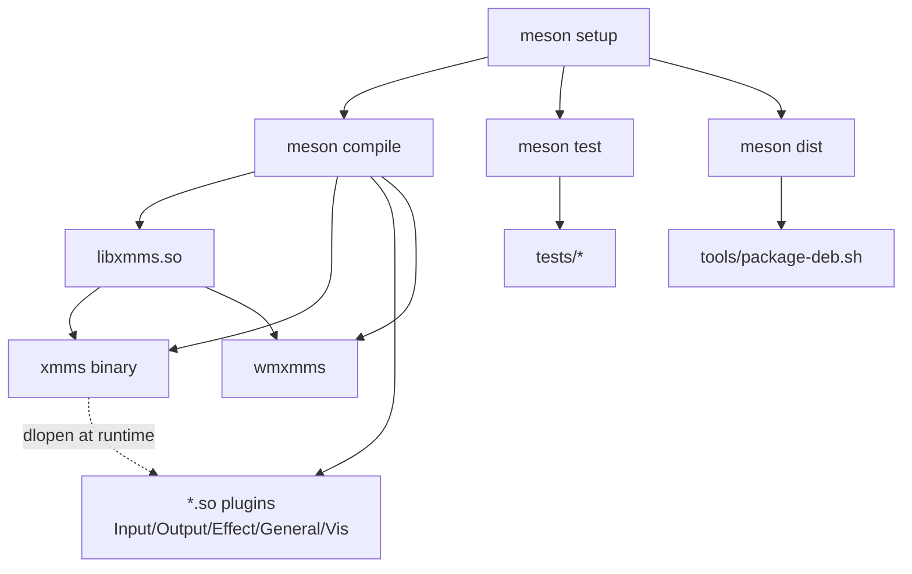
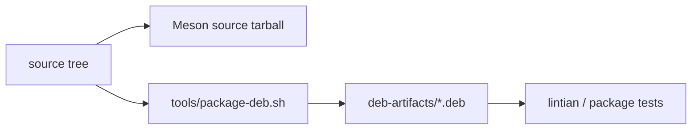
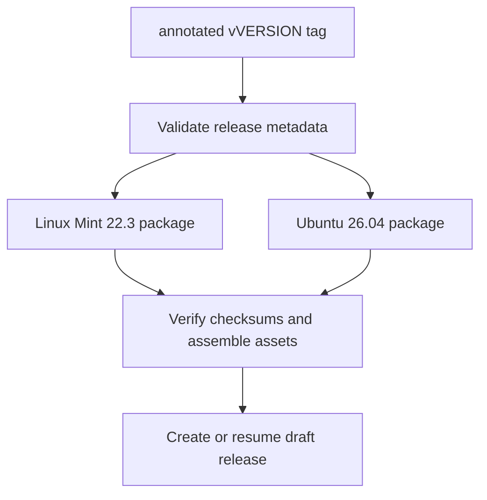

# Build layout, tests, and CI

This document orients newcomers to **how XMMS GTK4 Experimental is built and checked**,
not how to develop plugins. For day-to-day contributor commands see
[CONTRIBUTING.md](../../CONTRIBUTING.md); for release tagging see
[docs/releases.md](../releases.md).

The canonical contributor and agent gate is [`tools/preflight.sh`](../../tools/preflight.sh).
It requires system Meson, Ninja, Python 3, Cppcheck, Xvfb, ALSA development
headers, and Debian packaging tools (`dpkg-dev`, `debhelper`, `lintian`,
`binutils`, and `tar`); it never installs tools or downloads Meson wraps. On
Debian-family systems, install the complete package-gate environment:

```sh
sudo apt install build-essential git pkg-config gettext libasound2-dev libgl-dev \
  libgtk2.0-dev libgtk-3-dev libmikmod-dev libsm-dev libvorbis-dev \
  libxxf86vm-dev zlib1g-dev meson ninja-build python3 cppcheck xvfb xauth \
  dpkg-dev debhelper lintian binutils tar
```

Primary sources:

| Area | Files |
| --- | --- |
| Top-level build | [`meson.build`](../../meson.build), [`meson_options.txt`](../../meson_options.txt) |
| Library | [`libxmms/`](../../libxmms) |
| Player + plugins | [`xmms/`](../../xmms), [`Input/`](../../Input), [`Output/`](../../Output), … |
| Dock app | [`wmxmms/`](../../wmxmms) |
| Tests | [`tests/`](../../tests), [`tests/meson.build`](../../tests/meson.build) |
| C lint | [`tools/run-c-lint.sh`](../../tools/run-c-lint.sh), [`tools/cppcheck-suppressions.txt`](../../tools/cppcheck-suppressions.txt) |
| Packaging | [`packaging/debian/`](../../packaging/debian), [`tools/build-deb.sh`](../../tools/build-deb.sh) |
| Release packaging | [`.github/workflows/package-release.yml`](../../.github/workflows/package-release.yml) |
| Release tools | [`tools/check-release-version.sh`](../../tools/check-release-version.sh), `extract-release-notes.sh` |

---

## 1. Top-level shape

Meson is the sole build and delivery toolchain:

```text
meson.build / meson_options.txt  feature options and recursive build definition
libxmms/                         shared library + headers
xmms/                            main binary (links libxmms, dlopens plugins)
Input Output Effect General Visualization  plugin modules
wmxmms/                          dockapp binary
po/                              translations
tests/                           Meson regression suite
packaging/debian/                Meson debhelper package recipes
tools/                           preflight, package, and release helpers
.github/workflows/               manual release automation
```



### Runtime plugin locations

| Context | Where plugins load from |
| --- | --- |
| Installed | `PLUGIN_DIR` (e.g. `.../lib/xmms/{Input,Output,…}`) |
| Uninstalled / in-tree | Direct Meson targets: `BUILD_PLUGIN_DIR/{Input,Output,…}/<target>/lib*.so` when `PLUGIN_DIR` is not present yet |
| User override | `~/.xmms/Plugins` (and legacy subdirs) |

See [plugin-system.md](plugin-system.md) for search order and basename shadowing.

### Important configure knobs (high level)

| Flag / probe | Effect |
| --- | --- |
| GTK2 / GLib2 | Required production UI toolkit |
| GTK3 >= 3.24 | Isolated migration proof; controlled with `-Dgtk3-proof=auto`, `enabled`, or `disabled` |
| ALSA | `Output/alsa` (default preference on modern Linux) |
| `-Desd=disabled` | Skip ESD output (common in CI) |
| Vorbis / MikMod / OpenGL | Optional Input / Vis plugins |
| SIMD / IPv6 | Optional code paths |

Exact options live in `meson_options.txt`, `meson configure build-meson`, and [README](../../README.md).

---

## 2. What each major directory produces

| Tree | Artifact | Notes |
| --- | --- | --- |
| `libxmms/` | `libxmms.so` + headers | Remote API + config/title helpers |
| `xmms/` | `xmms` executable | Core UI + glue; **does not** statically link codecs |
| `Input/*`, `Output/*`, … | `lib*.so` Meson shared module | One plugin per subdirectory |
| `wmxmms/` | `wmxmms` executable | Socket client only |
| `po/` | `.mo` translations | gettext |
| `tests/` | test binaries + shell tests | Not installed |

Plugins export `get_*plugin_info` (see plugin-system). The main binary only
needs them at **run** time.

---

## 3. Test suite layout

Tests are orchestrated by [`tests/meson.build`](../../tests/meson.build)
through `meson test`. They are mostly **small C programs** using GLib’s
`g_test_*`, plus a few **shell** checks. Several compile a **slice** of
production `.c` files directly (not only the final binary)—useful when the
full UI would be too heavy.


### C / g_test style (representative)

| Test | Focus |
| --- | --- |
| `test-xentry` | `libxmms` entry word-motion / UTF-8 |
| `test-filebrowser` | file browser helpers in `xmms/util.c` |
| `test-font-load` | font fallback helpers |
| `test-popup-position` | menu/popup coordinate helpers (needs X11) |
| `test-pbutton-baseline` | GTK2 Play-button sprite, hit-boundary, pointer-state, and callback parity |
| `test-ui-control` | display-independent control state and sprite-command contract |
| `test-gtk3-play-button-proof` | separately linked GTK3 rendering and activation proof; link check rejects GTK2 |
| `test-pluginenum` | plugin scan/classify with **fixture** `.so` under `tests/test-plugins` |
| `test-pluginenum-meson-build` | actual Meson input/output plugin discovery from the build tree |
| `test-outputplugin` | legacy fixture ALSA path discovery helper coverage |
| `test-outputplugin-meson-build` | actual Meson ALSA path discovery from the build tree |
| `test-alsa-pcm-state` / `test-alsa-volume` | ALSA output internals |
| `test-mpg123-file-duration` / `test-mpg123-stream-position` | mpg123 duration/position logic |

Fixture plugins (`fixture-input-plugin.c`, `fixture-output-plugin.c`) are tiny
shared objects built into `tests/test-plugins/.../.libs` to retain legacy-layout
fallback coverage. Actual Meson plugin targets are tested separately.

### Shell tests

| Script | Focus |
| --- | --- |
| `test-package-recipes.sh` | Debian packaging expectations |
| `test-plugin-linkage.sh` | Built plugins link sanely |
| `test-release-tools.sh` | `check-release-version` / Meson version / changelog extraction |
| `verify-no-autotools-artifacts.sh` | Final-cutover source-tree contract |
| `test-package-artifact-contracts.sh` | Deterministic extracted-package and release-artifact verification |

### Running tests

```sh
tools/preflight.sh
```

Preflight configures a no-download Meson build, compiles, runs the complete
Xvfb-backed test suite, lint, package, and Meson source-distribution gates.
For an iterative check, use `xvfb-run --auto-servernum meson test -C
build-meson`; preflight remains the required contributor and agent gate.

When GTK3 development files are available, `test-gtk3-play-button-proof`
builds with target-specific GTK3 flags and Meson tests verify with `ldd`
that it links `libgtk-3` and not `libgtk-x11-2.0`. GTK3 and GTK2 are never
linked into the same test process. Debian build environments declare
`libgtk-3-dev`; Meson controls the proof with `-Dgtk3-proof=`.

### C static analysis

`tools/run-c-lint.sh` invokes Cppcheck. The runner owns the maintained
source-directory list, defect-oriented analyzer profile, library models,
relative paths, and fail-closed exit status.

Existing diagnostics are recorded narrowly as `diagnostic-id:path:line` in
`tools/cppcheck-suppressions.txt`. Unsuppressed diagnostics make Cppcheck exit
non-zero. The baseline is review data, not generated build output: maintainers
update individual entries only after triage, explain the change in the pull
request, and reject broad project-wide suppressions. Ubuntu 24.04's packaged
Cppcheck is the authoritative CI version.

Project-local Pi review configuration lives under `.pi/`. The pinned subagent
package is installed only after project trust into ignored `.pi/npm/` contents;
its two reviewer roles run locally and interactively, never in CI. The checked-in
settings, agents, prompt, and static contract test are source-distributed so the
review contract can be inspected before trust approval.

`tests/test-c-lint.sh` verifies missing-tool errors, analyzer arguments, source
scope, the accepted baseline, and rejection of a representative uninitialized
variable. The test runs through Meson; `tests/test-package-recipes.sh` also
guards the distributed target and manual release workflow wiring.

---

## 4. Packaging



| Path | Role |
| --- | --- |
| `packaging/debian/` | `control`, `rules`, `.install` files for `xmms` and `libxmms-dev` |
| `tools/package-deb.sh` | Creates the Meson source archive and local Debian packages |
| `tools/build-deb.sh` | Builds retained Debian metadata from the Meson source archive |
| `tools/verify-release-artifacts.sh` | Checks local package metadata, extracted smoke behavior, and checksum manifests |
| `packaging/xmms.desktop` | Desktop entry metadata |

Debian packages are a **distribution** concern; runtime architecture does not
change when installed from deb vs `meson install -C build-meson`.

---

## 5. Release-packaging workflow (GitHub Actions)

[`.github/workflows/package-release.yml`](../../.github/workflows/package-release.yml)
is a manual-only release workflow, not push/pull-request CI. A maintainer
supplies a version while dispatching the workflow from the matching annotated
`vVERSION` tag. The validation job rejects another ref, a lightweight tag,
metadata disagreement, or a tag not contained in `main`.



| Behavior | Detail |
| --- | --- |
| **Targets** | Linux Mint 22.3 and Ubuntu 26.04, each in a pinned container image on an Ubuntu 24.04 runner. |
| **Dependencies** | The package environment installs Git before checkout, then installs GTK2, `libgtk-3-dev`, Meson, Ninja, Cppcheck, Debian packaging tools, and Xvfb before building from the source archive. |
| **Verification** | Each target builds `xmms` and `libxmms-dev`, inspects metadata, extracts package payloads for smoke verification without host installation, and verifies its SHA-256 manifests. |
| **Permissions** | Default workflow permission is `contents: read`; only the final draft-release job receives `contents: write`. |
| **Publication** | The workflow creates or resumes an unpublished draft only and refuses to modify a published release. |

See [releases.md](../releases.md) for dispatch and manual draft-review steps.

---

## 6. How this relates to runtime architecture

| Build concern | Runtime doc |
| --- | --- |
| `libxmms` linked by `xmms` + `wmxmms` | [external-control.md](external-control.md) |
| Plugins as `.so` | [plugin-system.md](plugin-system.md) |
| `xmms` binary contents | [ui-interaction.md](ui-interaction.md), [processing-pipeline.md](processing-pipeline.md) |
| Tests for pluginenum / ALSA / mpg123 | Guard rails for those subsystems—not a second architecture |

When you change glue code (`pluginenum`, `outputplugin`, playlist info,
control socket), look for a **targeted test** under `tests/` before relying
only on manual UI clicks.

---

## 7. Newcomer checklist

1. `tools/preflight.sh`
2. Run `build-meson/xmms/xmms` from any working directory (plugins resolve via the absolute `BUILD_PLUGIN_DIR`) or install
3. Read [ui-interaction.md](ui-interaction.md) then
   [processing-pipeline.md](processing-pipeline.md)  
4. For packaging work, start with `packaging/debian/` + `tools/package-deb.sh`
5. For release automation, start with `tools/*` + `docs/releases.md`  

---

## Related reading

- [CONTRIBUTING.md](../../CONTRIBUTING.md) — PR expectations  
- [docs/releases.md](../releases.md) — release process  
- [Plugin system](plugin-system.md) — what the build’s `.so` files mean at runtime  
- [External control](external-control.md) — `libxmms` / `wmxmms` consumers  
