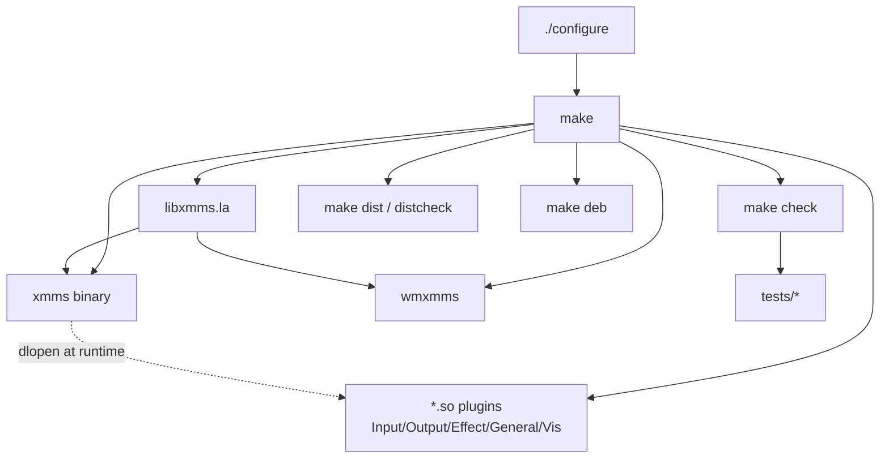
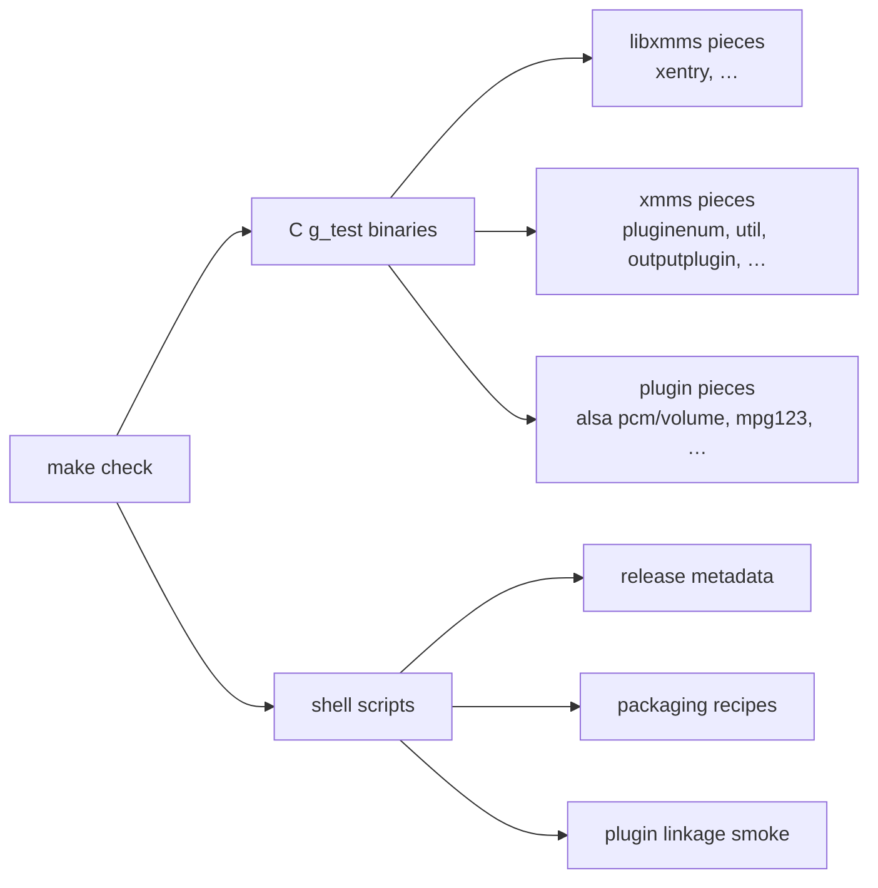
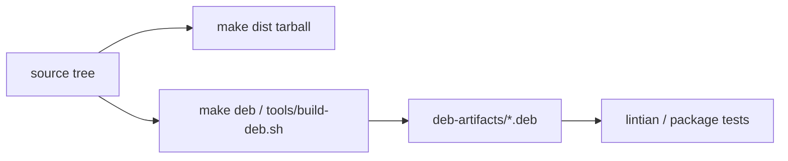
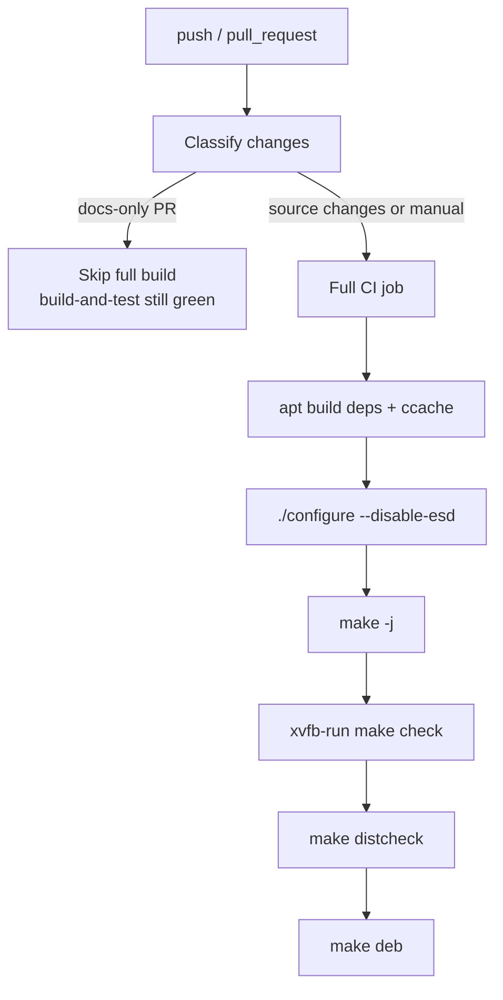

# Build layout, tests, and CI

This document orients newcomers to **how XMMS Classic is built and checked**,
not how to develop plugins. For day-to-day contributor commands see
[CONTRIBUTING.md](../../CONTRIBUTING.md); for release tagging see
[docs/releases.md](../releases.md).

Primary sources:

| Area | Files |
| --- | --- |
| Top-level build | [`configure.in`](../../configure.in), [`Makefile.am`](../../Makefile.am) |
| Library | [`libxmms/`](../../libxmms) |
| Player + plugins | [`xmms/`](../../xmms), [`Input/`](../../Input), [`Output/`](../../Output), … |
| Dock app | [`wmxmms/`](../../wmxmms) |
| Tests | [`tests/`](../../tests), [`tests/Makefile`](../../tests/Makefile) |
| Packaging | [`packaging/debian/`](../../packaging/debian), [`tools/build-deb.sh`](../../tools/build-deb.sh) |
| CI | [`.github/workflows/ci.yml`](../../.github/workflows/ci.yml) |
| Release tools | [`tools/check-release-version.sh`](../../tools/check-release-version.sh), `extract-release-notes.sh` |

---

## 1. Top-level shape

Autotools project (autoconf/automake + libtool for plugins):

```text
configure.in / configure     feature probes (GTK2, ALSA, Vorbis, MikMod, …)
Makefile.am                  SUBDIRS order
  intl
  libxmms                    shared library + headers
  xmms                       main binary (links libxmms, dlopens plugins)
  Output Input Effect General Visualization
  wmxmms                     dockapp binary
  po                         translations
tests/                       regression suite (invoked via make check)
packaging/debian/            Debian package recipes
tools/                       deb build + release helpers
.github/workflows/           CI and release automation
```



### Runtime plugin locations

| Context | Where plugins load from |
| --- | --- |
| Installed | `PLUGIN_DIR` (e.g. `.../lib/xmms/{Input,Output,…}`) |
| Uninstalled / in-tree | `BUILD_PLUGIN_DIR/.../.libs` when `PLUGIN_DIR` is not present yet |
| User override | `~/.xmms/Plugins` (and legacy subdirs) |

See [plugin-system.md](plugin-system.md) for search order and basename shadowing.

### Important configure knobs (high level)

| Flag / probe | Effect |
| --- | --- |
| GTK2 / GLib2 | Required UI toolkit |
| ALSA | `Output/alsa` (default preference on modern Linux) |
| `--disable-esd` | Skip ESD output (common in CI) |
| Vorbis / MikMod / OpenGL | Optional Input / Vis plugins |
| SIMD / IPv6 | Optional code paths |

Exact flags live in `./configure --help` and [README](../../README.md).

---

## 2. What each major directory produces

| Tree | Artifact | Notes |
| --- | --- | --- |
| `libxmms/` | `libxmms.so` + headers | Remote API + config/title helpers |
| `xmms/` | `xmms` executable | Core UI + glue; **does not** statically link codecs |
| `Input/*`, `Output/*`, … | `lib*.so` via libtool | One plugin per subdirectory |
| `wmxmms/` | `wmxmms` executable | Socket client only |
| `po/` | `.mo` translations | gettext |
| `tests/` | test binaries + shell tests | Not installed |

Plugins export `get_*plugin_info` (see plugin-system). The main binary only
needs them at **run** time.

---

## 3. Test suite layout

Tests are orchestrated by [`tests/Makefile`](../../tests/Makefile) (`make check`
from the build tree). They are mostly **small C programs** using GLib’s
`g_test_*`, plus a few **shell** checks. Several compile a **slice** of
production `.c` files directly (not only the final binary)—useful when the
full UI would be too heavy.



### C / g_test style (representative)

| Test | Focus |
| --- | --- |
| `test-xentry` | `libxmms` entry word-motion / UTF-8 |
| `test-filebrowser` | file browser helpers in `xmms/util.c` |
| `test-font-load` | font fallback helpers |
| `test-popup-position` | menu/popup coordinate helpers (needs X11) |
| `test-pluginenum` | plugin scan/classify with **fixture** `.so` under `tests/test-plugins` |
| `test-outputplugin` | ALSA path discovery helpers in `outputplugin.c` |
| `test-alsa-pcm-state` / `test-alsa-volume` | ALSA output internals |
| `test-mpg123-file-duration` / `test-mpg123-stream-position` | mpg123 duration/position logic |

Fixture plugins (`fixture-input-plugin.c`, `fixture-output-plugin.c`) are tiny
shared objects built into `tests/test-plugins/.../.libs` so `pluginenum` can be
tested without the full codec stack.

### Shell tests

| Script | Focus |
| --- | --- |
| `test-intl-generated-sources.sh` | i18n/generated source consistency |
| `test-package-recipes.sh` | Debian packaging expectations |
| `test-plugin-linkage.sh` | Built plugins link sanely |
| `test-release-tools.sh` | `check-release-version` / changelog extraction |

### Running tests

```sh
./configure --disable-esd
make -j"$(nproc)"
make check                          # needs display for some GTK tests
xvfb-run --auto-servernum make check
```

`make distcheck` rebuilds from a tarball and re-runs checks—the stricter bar
used in CI.

---

## 4. Packaging



| Path | Role |
| --- | --- |
| `packaging/debian/` | `control`, `rules`, `.install` files for `xmms` and `libxmms-dev` |
| `tools/build-deb.sh` | Helper invoked via `make deb` |
| `packaging/xmms.desktop` | Desktop entry metadata |

Debian packages are a **distribution** concern; runtime architecture does not
change when installed from deb vs `make install`.

---

## 5. CI pipeline (GitHub Actions)

[`.github/workflows/ci.yml`](../../.github/workflows/ci.yml) on `ubuntu-24.04`:



| Behavior | Detail |
| --- | --- |
| **Path filter** | Docs/README-only PRs skip configure/build/test/distcheck/deb |
| **Required check** | Aggregate `build-and-test` job always runs and reflects skip vs full result |
| **Display** | `xvfb-run` for GTK tests |
| **Cache** | ccache via [`.github/actions/setup-ccache`](../../.github/actions/setup-ccache) |

Other workflows (`release-candidate.yml`, `release.yml`, `package-release.yml`)
handle versioned releases; see [releases.md](../releases.md).

---

## 6. How this relates to runtime architecture

| Build concern | Runtime doc |
| --- | --- |
| `libxmms` linked by `xmms` + `wmxmms` | [external-control.md](external-control.md) |
| Plugins as `.so` | [plugin-system.md](plugin-system.md) |
| `xmms` binary contents | [ui-interaction.md](ui-interaction.md), [processing-pipeline.md](processing-pipeline.md) |
| Tests for pluginenum / ALSA / mpg123 | Guard rails for those subsystems—not a second architecture |

When you change glue code (`pluginenum`, `outputplugin`, playlist info,
control socket), look for a **targeted test** under `tests/` before relying
only on manual UI clicks.

---

## 7. Newcomer checklist

1. `./configure --disable-esd && make -j && xvfb-run make check`  
2. Run `xmms` from the build tree (plugins via `BUILD_PLUGIN_DIR`) or install  
3. Read [ui-interaction.md](ui-interaction.md) then
   [processing-pipeline.md](processing-pipeline.md)  
4. For packaging work, start with `packaging/debian/` + `make deb`  
5. For release automation, start with `tools/*` + `docs/releases.md`  

---

## Related reading

- [CONTRIBUTING.md](../../CONTRIBUTING.md) — PR expectations  
- [docs/releases.md](../releases.md) — release process  
- [Plugin system](plugin-system.md) — what the build’s `.so` files mean at runtime  
- [External control](external-control.md) — `libxmms` / `wmxmms` consumers  
