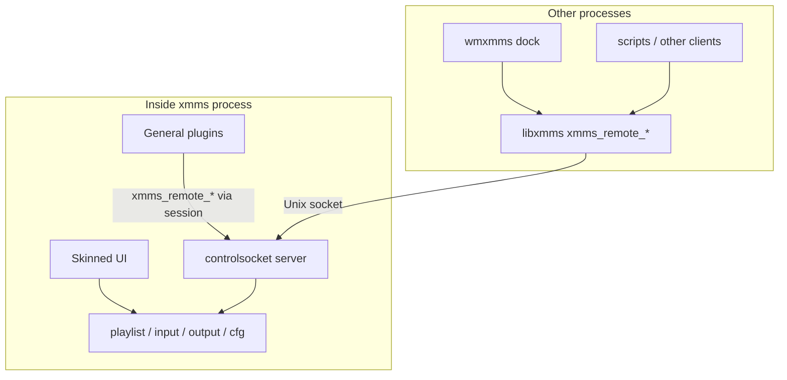
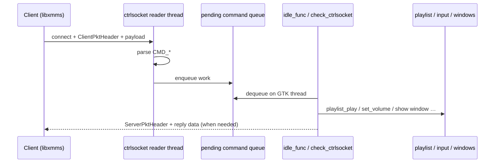
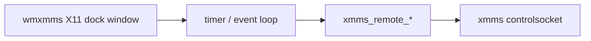
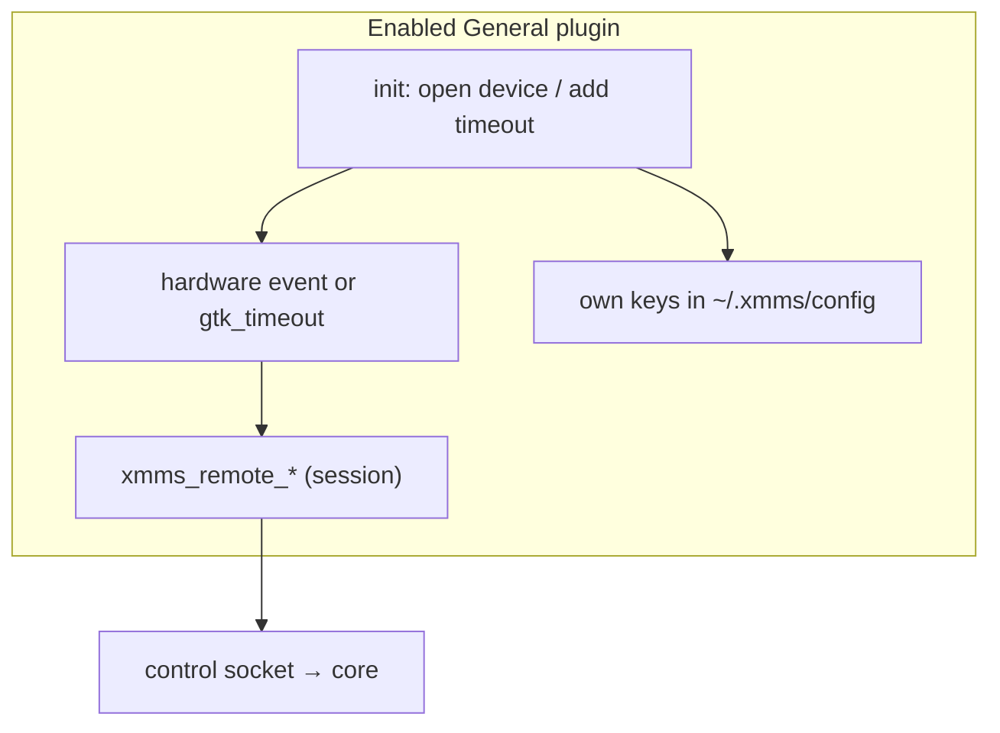
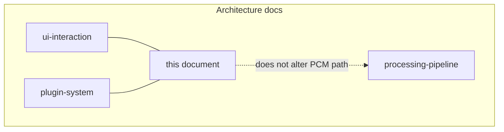

# External control: libxmms, wmxmms, and General plugins

XMMS GTK4 Experimental is not only the three skinned windows. A second process model sits
beside the UI: **clients talk to a running `xmms` over a Unix-domain control
socket**, using APIs in **`libxmms`**. Dock apps, scripts, IR remotes, and
in-process General plugins all share that path.

For the socket’s place in the UI heartbeat, see
[ui-interaction.md §7](ui-interaction.md#7-remote-control-and-headless-ui-actions).
For how General plugins are loaded, see [plugin-system.md](plugin-system.md).

Primary sources:

| Area | Files |
| --- | --- |
| Client API | [`libxmms/xmmsctrl.c`](../../libxmms/xmmsctrl.c), [`libxmms/xmmsctrl.h`](../../libxmms/xmmsctrl.h) |
| Server | [`xmms/controlsocket.c`](../../xmms/controlsocket.c), [`xmms/controlsocket.h`](../../xmms/controlsocket.h) |
| Dock app | [`wmxmms/wmxmms.c`](../../wmxmms/wmxmms.c) |
| General glue | [`xmms/general.c`](../../xmms/general.c), [`xmms/general.h`](../../xmms/general.h) |
| Shipped General plugins | [`General/ir`](../../General/ir), [`General/joystick`](../../General/joystick), [`General/song_change`](../../General/song_change) |
| Shared helpers | [`libxmms/`](../../libxmms) (`configfile`, `titlestring`, `formatter`, …) |

---

## 1. Why a separate control path exists

The classic WinAmp-style UI is one client of the player. Others need the same
transport without embedding GTK chrome or linking the whole `xmms` binary:

| Consumer | Process | How it reaches core APIs |
| --- | --- | --- |
| Main skinned UI | `xmms` | Direct C calls (`playlist_play`, `input_*`, …) |
| **wmxmms** | separate | `xmms_remote_*` → control socket |
| Scripts / tools | separate | same client API (or raw protocol) |
| **General plugins** | inside `xmms` | often `xmms_remote_*` with `xmms_session` |
| Vis plugins (optional) | inside `xmms` | same session id if they need remote ops |

Design rule: **prefer core APIs + thin socket handlers** so UI and remote
clients stay consistent (see ui-interaction takeaways).



---

## 2. libxmms: shared library surface

`libxmms` is a small shared library installed with development headers under
`$(includedir)/xmms`. It is **not** the media engine; it is helpers + remote
control.

| Module | Role |
| --- | --- |
| **`xmmsctrl`** | Client side of the control protocol (`xmms_remote_play`, …) |
| **`configfile`** | Read/write `~/.xmms/config`-style key/value files |
| **`titlestring` / `formatter`** | Title format expansion for playlist/display |
| **`dirbrowser` / `xentry` / `xconvert` / `charset` / `util`** | UI/string helpers reused by the player and plugins |

Link against `libxmms` when writing an external controller or a plugin that
should not `#include` private `xmms/*.c` internals.

Typical client usage pattern:

```c
gint session = 0;  /* or -s / configure choice */
if (!xmms_remote_is_running(session))
    /* start xmms or error out */;
xmms_remote_playlist_add_url_string(session, path);
xmms_remote_play(session);
```

Session ids distinguish multiple simultaneous XMMS instances when
`allow_multiple_instances` is enabled; the server binds a socket name that
includes the session number (`controlsocket.c`).

---

## 3. Control socket protocol (medium level)



| Piece | Detail |
| --- | --- |
| Transport | `AF_UNIX` stream socket |
| Framing | `ClientPktHeader` / `ServerPktHeader` in [`controlsocket.h`](../../xmms/controlsocket.h) |
| Commands | `CMD_PLAY`, `CMD_PAUSE`, playlist ops, volume, EQ, window toggles, quit, playqueue, … |
| Threading | **Reader thread** accepts and parses; **`check_ctrlsocket()`** applies on the main/GTK thread from `idle_func` |

That split avoids driving GTK and playlist locks from the socket thread.

---

## 4. wmxmms: Window Maker dock client

[`wmxmms`](../../wmxmms) is a **separate executable** built from the top-level
Automake tree (`SUBDIRS` includes `wmxmms`). It is a small dockapp that:

- connects with `xmms_session` (CLI `-s` / `--session`, default `0`)
- polls running/playing state, title, time, volume
- sends play/pause/stop/next/prev, seek, volume, window show/hide, open URL



It does **not** decode audio or load skins for the main player. If `xmms` is
not running, remote calls fail/`is_running` is false—the dock is a remote
control, not a second engine.

Related: other historical front-ends (e.g. old GNOME applets) used the same
`xmms_remote_*` API; this fork ships **wmxmms** in-tree as the canonical
out-of-process example.

---

## 5. General plugins

General plugins are **in-process** modules (`get_gplugin_info`) that are **not**
on the PCM path. Lifecycle:

1. Loaded at startup with other plugins ([plugin-system.md](plugin-system.md))
2. Core sets `xmms_session` on the vtable
3. User enables them in Preferences → General
4. `enable_general_plugin` → `init()`; disable → `cleanup()`
5. Enabled basenames persisted in `cfg.enabled_gplugins`

```text
GeneralPlugin {
    handle, filename, xmms_session, description,
    init, about, configure, cleanup
}
```

No `mod_samples`, no `write_audio`. Anything “player-like” goes through
`xmms_remote_*` (or, rarely, direct core calls if the plugin were linked that
way—the shipped ones use the remote API).

### Shipped General plugins

| Plugin | Directory | Role |
| --- | --- | --- |
| **IR** | `General/ir` | Read an infrared remote (Irman-style); map buttons to play/stop/seek/volume/playlist via `xmms_remote_*` |
| **Joystick** | `General/joystick` | Game-device events → transport / volume style actions |
| **Song Change** | `General/song_change` | On track change / after song / playlist end, run user shell commands; formats title/time via remote + `formatter` |



**Song Change** is a good minimal template: `gtk_timeout_add` polls playlist
position through `xmms_remote_get_playlist_pos` / title / time, then
`fork`/`exec`s a configured command line. It never touches Input/Output
vtables.

**IR / Joystick** show the other pattern: block or poll on a device fd, then
issue the same remote commands a dock button would.

---

## 6. How this fits the rest of the architecture



| Question | Answer |
| --- | --- |
| Does a General plugin hear PCM? | No |
| Can wmxmms work without the main window visible? | Yes, if `xmms` is running |
| Should a new tray/media-key integration be Input or General? | **General** (or an external `libxmms` client) |
| Should it call `playlist_play` directly? | Prefer **`xmms_remote_play`** from plugins/clients so locking/socket rules stay centralized |

---

## 7. Adding a new external controller (checklist)

1. **Out-of-process:** link `libxmms`, use `xmms_remote_*`, handle
   `is_running` / session id.  
2. **In-process General plugin:** export `get_gplugin_info`, implement
   `init`/`cleanup`, use `plugin->xmms_session` with `xmms_remote_*`.  
3. Do not start your own decode path; do not `dlopen` Output plugins.  
4. Keep GTK work on the GTK thread; use timeouts/idle like Song Change.  
5. Persist settings with `xmms_cfg_*` (`libxmms/configfile`) under a private
   section name.

---

## Related reading

- [UI interaction](ui-interaction.md) — idle loop + socket apply path  
- [Plugin system](plugin-system.md) — discovery and enable lists  
- [Processing pipeline](processing-pipeline.md) — audio path (orthogonal)  
- User manual plugin section in [docs/manual.md](../manual.md#36-plugins)  
