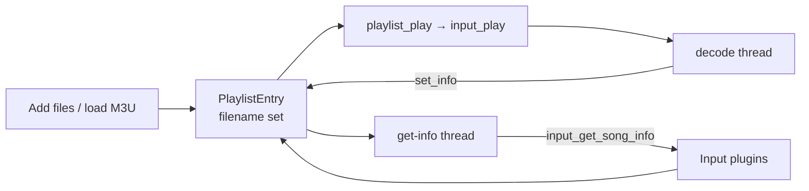
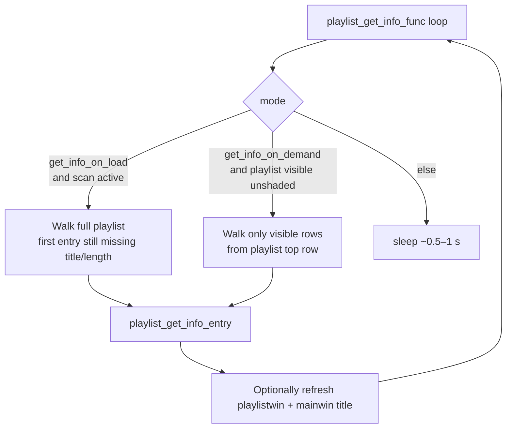
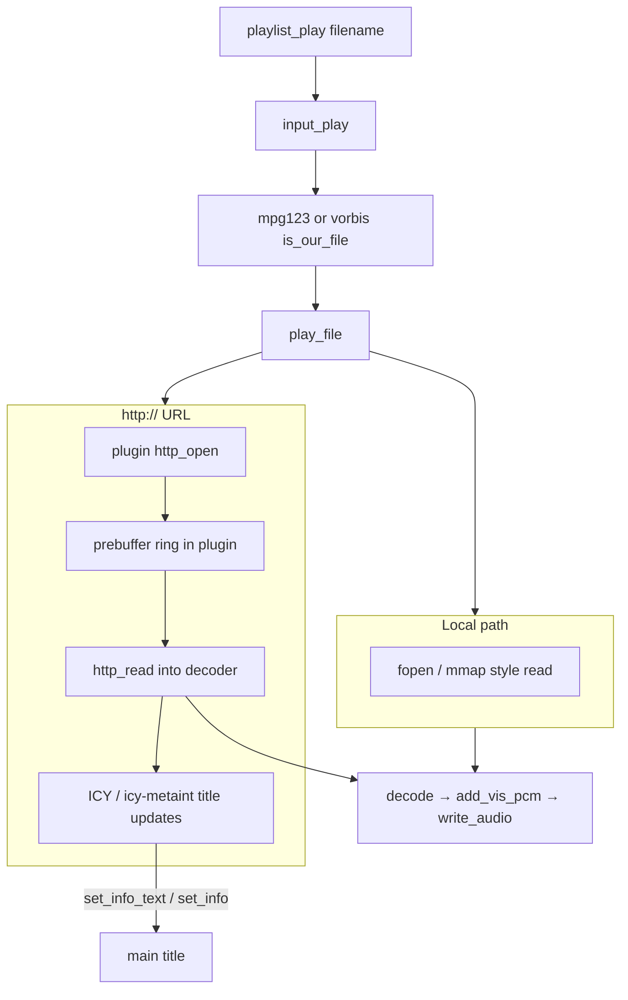
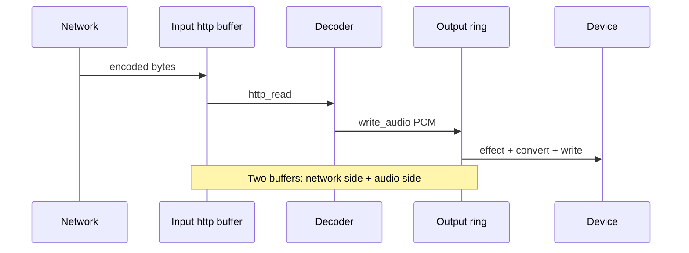

# Playlist metadata thread and HTTP streaming

Two important paths sit *beside* the main decode → output pipeline:

1. **Playlist get-info thread** — fills titles/durations without blocking the UI  
2. **HTTP/Icecast-style streaming** — inside Input plugins (mpg123, vorbis), not in the core

Together they explain why playlist rows populate asynchronously and why a
network URL still looks like a normal `play_file` to the rest of XMMS.

Primary sources:

| Area | Files |
| --- | --- |
| Playlist model + info thread | [`xmms/playlist.c`](../../xmms/playlist.c) |
| Song info probe API | [`xmms/input.c`](../../xmms/input.c) (`input_get_song_info`) |
| Config knobs | `cfg.get_info_on_load`, `cfg.get_info_on_demand` in [`xmms/main.h`](../../xmms/main.h) |
| MP3 HTTP | [`Input/mpg123/http.c`](../../Input/mpg123/http.c), `mpg123.c` |
| Vorbis HTTP | [`Input/vorbis/http.c`](../../Input/vorbis/http.c), `vorbis.c` |

For the PCM write path after decode starts, see
[processing-pipeline.md](processing-pipeline.md).

---

## 1. Playlist entries vs playback

A playlist entry is lightweight until something asks for metadata:

```text
PlaylistEntry {
    filename,   /* always */
    title,      /* NULL until probed or set from EXTINF / set_info */
    length,     /* -1 until known (ms) */
    selected, queued, …
}
```

| Who sets title/length | When |
| --- | --- |
| M3U `#EXTINF` / PLS import | Load time (`playlist_load`) |
| **Get-info thread** | Background probe via `input_get_song_info` |
| Current Input during play | `set_info` → `playlist_set_info` (bitrate/freq too for UI) |
| User “Read info” actions | Explicit `playlist_read_info*` |

Playback only needs **`filename`**. Missing titles do not block `playlist_play`.



---

## 2. Get-info thread

Started from main startup as `playlist_start_get_info_thread()` and torn down
with `playlist_stop_get_info_thread()`.



### `playlist_get_info_entry` locking rule

Critical detail when reading or modifying playlist code:

1. Caller holds **`PL_LOCK`**
2. Function **copies `filename`**, then **`PL_UNLOCK`s**
3. Calls **`input_get_song_info`** (may block on disk/network tags)
4. **`PL_LOCK`s** again, checks the entry pointer is still in the list
5. Writes `title` / `length` or aborts if the row was deleted

So info probing never holds the playlist mutex across slow I/O. Callers must
tolerate “entry disappeared” and restart iteration (the thread already does).

### Config behavior

| Setting | Effect |
| --- | --- |
| **`get_info_on_load`** | After loads/adds, scan the whole list until every entry has info or fails |
| **`get_info_on_demand`** | Only probe rows currently visible in the playlist window |
| Neither path busy | Thread sleeps; UI stays responsive |

`playlist_start_get_info_scan()` sets `playlist_get_info_scan_active` so a
fresh load can trigger a full pass when on-load mode is enabled.

### What `input_get_song_info` does

Mirrors playback plugin selection **without** starting audio:

- Walk enabled Input plugins  
- First `is_our_file(filename)` wins  
- Call `get_song_info` if present  
- Else synthesize a title from the basename + title format (`libxmms`
  titlestring) and `length = -1`

HTTP URLs may be slow or weak on length; the thread simply moves on.

---

## 3. HTTP streaming lives in Input plugins

The core playlist and output layers treat a stream like a file whose name
starts with `http://` (and similar). **No core HTTP stack** sits under
`xmms/`. Each Input that supports streaming embeds its own client.

| Plugin | HTTP pieces | Notes |
| --- | --- | --- |
| **mpg123** | `Input/mpg123/http.c` | MP3 streams, ICY metadata, optional save-to-disk |
| **vorbis** | `Input/vorbis/http.c` | Ogg over HTTP; seek disabled while streaming |



### Shared patterns (mpg123 & vorbis)

1. **`play_file`**: if URL scheme is HTTP → `*_http_open`, else filesystem open  
2. **Prebuffer**: wait until `http_prebuffer` / buffer fill before starting
   steady decode (config under each plugin’s preferences)  
3. **Decode loop**: pull encoded bytes via `*_http_read` instead of `fread`  
4. **Titles**: stream metadata (e.g. ICY) can update the UI through the usual
   `set_info` / `set_info_text` callbacks  
5. **Seek**: often no-op or limited while `is_streaming`  
6. **Stop**: `http_close` + join decode thread + `output->close_audio`

### Back-pressure still applies

Once PCM is produced, the **same** Output contract holds
(`buffer_free` / `write_audio`). Network jitter is absorbed first in the
**plugin HTTP buffer**, then in the **output ring buffer**. Visualization
still timestamps with `written_time()`.



### What the core does *not* do

- No global proxy manager beyond what each plugin implements  
- No separate “stream input” plugin type—streaming is a mode of Input  
- Playlist get-info may call `get_song_info` on a URL; that must be cheap or
  fail soft so the info thread does not stall forever (plugin-dependent)

---

## 4. Interaction with UI and remote control

| Action | Metadata path | Streaming path |
| --- | --- | --- |
| Add `http://…` to playlist | Entry stored; info thread may probe | Not connected yet |
| Play that row | `set_info` from decoder/stream | `http_open` in Input |
| Song Change / wmxmms title | Reads playlist title via socket | Sees updates after `set_info` |
| Stop | Info thread unaffected | Input closes HTTP + audio |

Remote clients (`xmms_remote_playlist_add_url_string`, etc.) only enqueue
filenames/URLs; they do not implement HTTP.

---

## 5. Mental model for newcomers

1. **Playlist = ordered filenames (+ lazy metadata).**  
2. **Get-info thread = nice-to-have titles/lengths**, carefully unlocked.  
3. **Streaming = Input plugin detail**, underneath the same play/output API.  
4. When debugging a hung playlist UI, check whether something holds `PL_LOCK`
   across I/O (it should not).  
5. When debugging a stalling stream, inspect the **plugin** HTTP buffer and
   network path first, then Output `buffer_free`.

---

## Related reading

- [Processing pipeline](processing-pipeline.md) — decode/output after play  
- [UI interaction](ui-interaction.md) — playlist window as view on this model  
- [External control](external-control.md) — clients adding URLs remotely  
- [Plugin system](plugin-system.md) — Input vtables (`get_song_info`, `play_file`)  
