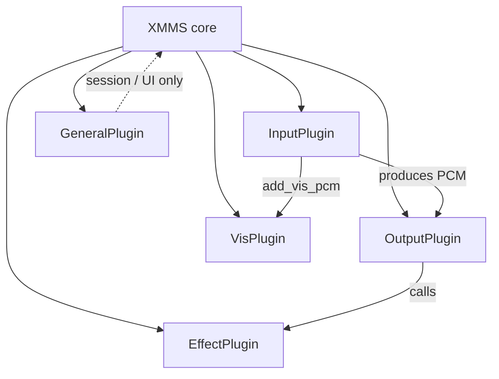
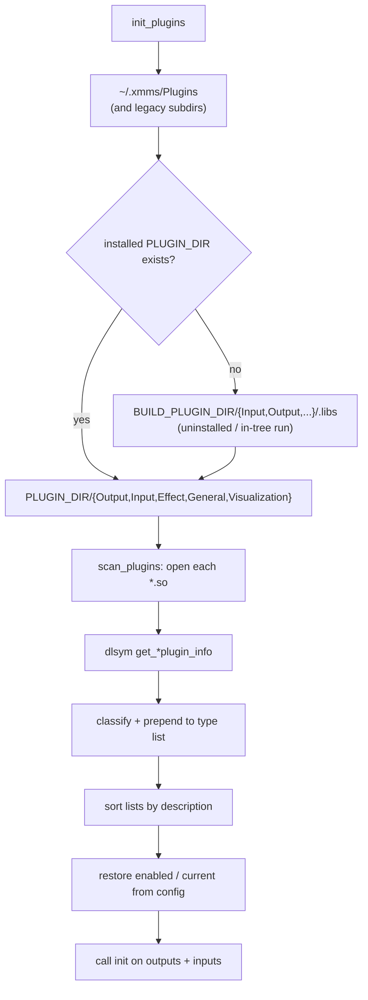
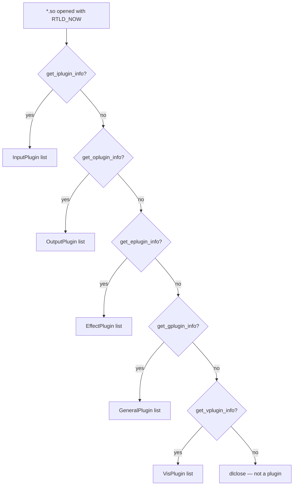
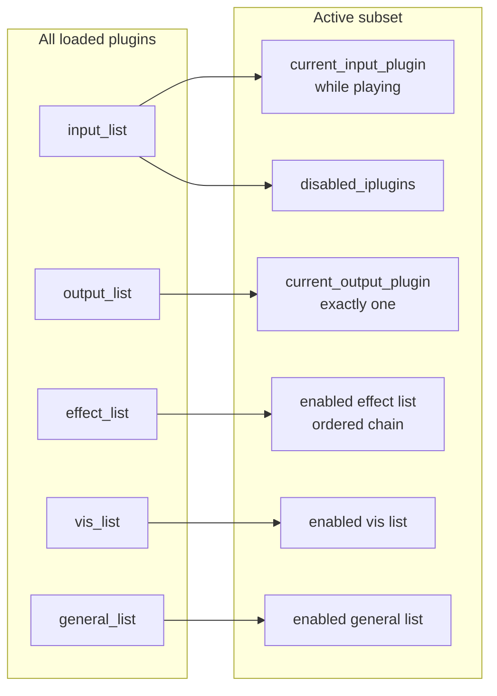
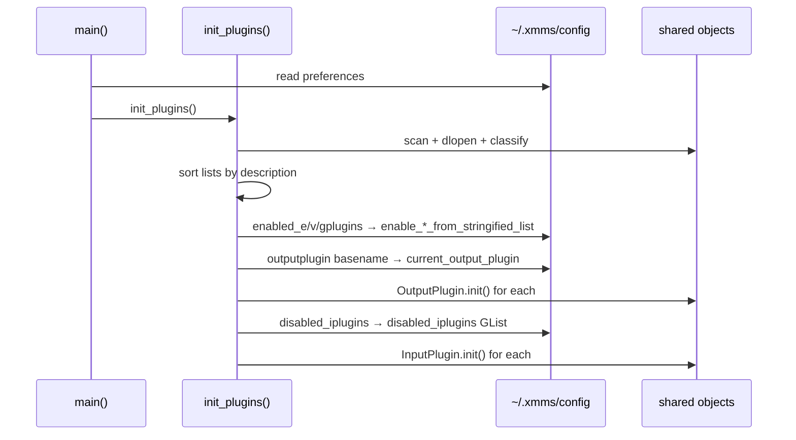
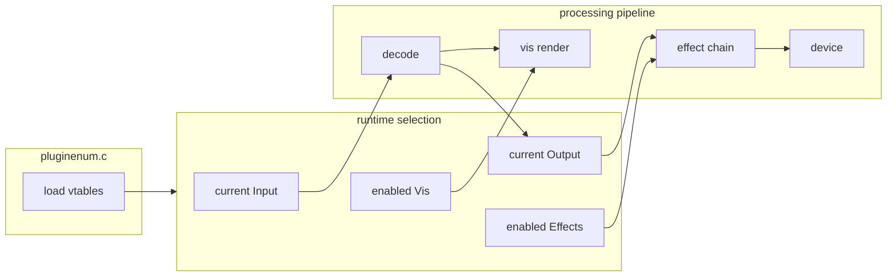

# Plugin system

XMMS GTK4 Experimental’s processing pipeline is entirely plugin-driven. This document
covers how plugins are discovered, classified, wired into the core, and
lifecycle-managed. For the PCM path itself, see
[processing-pipeline.md](processing-pipeline.md).

Primary sources:

| Area | Files |
| --- | --- |
| Vtable definitions | [`xmms/plugin.h`](../../xmms/plugin.h) |
| Discovery / load / unload | [`xmms/pluginenum.c`](../../xmms/pluginenum.c) |
| Per-type glue | [`xmms/input.c`](../../xmms/input.c), [`output.c`](../../xmms/output.c), [`effect.c`](../../xmms/effect.c), [`visualization.c`](../../xmms/visualization.c), [`general.c`](../../xmms/general.c) |
| ALSA path preference helpers | [`xmms/outputplugin.c`](../../xmms/outputplugin.c) |

---

## 1. Plugin kinds



| Kind | Entry symbol | Multiplicity in use | On PCM path? |
| --- | --- | --- | --- |
| **Input** | `get_iplugin_info` | One *current* while playing; many loaded | Yes — source |
| **Output** | `get_oplugin_info` | Exactly one *current* | Yes — sink |
| **Effect** | `get_eplugin_info` | Zero or more *enabled*, chained | Yes — transform |
| **Visualization** | `get_vplugin_info` | Zero or more *enabled* | Side-channel |
| **General** | `get_gplugin_info` | Zero or more *enabled* | No |

Each shared object exports exactly one of the `get_*plugin_info` functions.
That function returns a pointer to a static vtable struct (`InputPlugin`,
`OutputPlugin`, …). The core fills bookkeeping fields (`handle`, `filename`,
and several callbacks) after load.

### GTK-major linkage policy

The C vtable layouts and exported entry points remain compatibility contracts,
but they do not guarantee toolkit compatibility. Plugin `about`, `configure`,
file-info, and visualization implementations may link GTK and execute inside
the player process. Loading a GTK2-linked module into a future GTK3 or GTK4
player would create unsafe mixed GTK-major linkage.

Accordingly, the staged migration preserves plugin ABI shapes where possible
but requires UI-bearing plugins to be rebuilt or ported for the player's
active GTK major. The GTK3 migration proof never loads plugins, and the
production GTK2 player continues to load existing GTK2 plugins until a later
explicit toolkit-switch gate.

---

## 2. Discovery and load order



Search order favors **user plugins first**, then the build tree (only when
not installed), then the system plugin directory. Basename de-duplication
means a user-installed `libALSA.so` shadows the system one.

### Classification (`add_plugin`)



After a successful Input load, the core **injects** helpers the plugin will
call back into:

| Field set by core | Implementation |
| --- | --- |
| `get_vis_type` | stub (`INPUT_VIS_OFF`) — obsolete API |
| `add_vis_pcm` | `input_add_vis_pcm` |
| `set_info` | `playlist_set_info` |
| `set_info_text` | `input_set_info_text` |
| `output` | set later, at `input_play` time |

Vis and General plugins also receive `xmms_session` (control socket id) and
Vis gets `disable_plugin`.

---

## 3. Vtable cheat sheet

### InputPlugin — decode & control

```text
is_our_file → play_file → (decode thread)
                ├─ output->open_audio / write_audio / buffer_free / …
                ├─ add_vis_pcm(...)
                ├─ set_info / set_info_text
                └─ stop / pause / seek / get_time / set_eq
```

| Method | Role |
| --- | --- |
| `is_our_file` | Probe; first match wins |
| `play_file` / `stop` / `pause` / `seek` | Transport |
| `get_time` | ms position, or `-1` EOF / `-2` output failure |
| `set_eq` | Optional decoder-side equalizer |
| `get_song_info` / `file_info_box` / `scan_dir` | Metadata & browsing |
| `output` | Filled by core; decoder’s only link to the sink |

### OutputPlugin — buffer & device

| Method | Role |
| --- | --- |
| `open_audio` / `close_audio` | Stream lifetime |
| `write_audio` / `buffer_free` | Producer API used by inputs |
| `buffer_playing` / `output_time` / `written_time` | Timing |
| `flush` / `pause` | Seek & pause support |
| `get_volume` / `set_volume` | Hardware or software volume |

### EffectPlugin — PCM transform

| Method | Role |
| --- | --- |
| `mod_samples` | In-place process; may change length |
| `query_format` | May request different fmt/rate/channels |
| `init` / `cleanup` | Called when enabled/disabled |

### VisPlugin — render

| Method | Role |
| --- | --- |
| `num_pcm_chs_wanted` / `num_freq_chs_wanted` | Declares needs |
| `render_pcm` / `render_freq` | Fast per-block draw hooks |
| `playback_start` / `playback_stop` | Track boundaries |

### GeneralPlugin — everything else

Init/about/configure/cleanup only. Typical uses: multimedia keys, tray
integration, remote helpers. They talk to XMMS through the control socket
(`libxmms/xmmsctrl`) rather than PCM APIs.

---

## 4. Runtime selection model



| Type | How “active” is chosen | Persisted as |
| --- | --- | --- |
| Output | User preference / first available; basename match on `cfg.outputplugin` | single filename |
| Input | First `is_our_file` hit among non-disabled | disabled list (comma-separated basenames) |
| Effect | Explicit enable checkboxes | `cfg.enabled_eplugins` |
| Vis | Explicit enable checkboxes | `cfg.enabled_vplugins` |
| General | Explicit enable checkboxes | `cfg.enabled_gplugins` |

Effects and visualization are always mediated by **enabled lists**. The
effect side additionally exposes a compatibility facade:

```c
EffectPlugin *get_current_effect_plugin(void);  /* → pseudo chain */
int effects_enabled(void);                      /* → always TRUE */
```

Output plugins written for classic single-effect XMMS keep working; the
pseudo plugin fans calls out to every enabled effect in order.

---

## 5. Config ↔ plugin wiring at startup



Shutdown (`cleanup_plugins`) reverses this carefully: stop playback, call
input/effect cleanups (pumping the GTK main loop between plugins), disable
general/vis plugins, then `dlclose` everything.

---

## 6. How a third-party plugin attaches to the pipeline

Minimal mental model for each kind:

```mermaid
flowchart TB
    subgraph NewInput["New Input plugin"]
        A1[export get_iplugin_info]
        A2[implement is_our_file + play_file]
        A3["in play_file thread:<br/>output->open_audio<br/>add_vis_pcm<br/>output->write_audio"]
        A1 --> A2 --> A3
    end

    subgraph NewOutput["New Output plugin"]
        B1[export get_oplugin_info]
        B2[implement open/write/buffer_free/times]
        B3["in write path:<br/>get_current_effect_plugin<br/>mod_samples then h/w write"]
        B1 --> B2 --> B3
    end

    subgraph NewEffect["New Effect plugin"]
        C1[export get_eplugin_info]
        C2[implement mod_samples]
        C3[optional query_format]
        C1 --> C2 --> C3
    end

    subgraph NewVis["New Vis plugin"]
        D1[export get_vplugin_info]
        D2["set num_*_chs_wanted"]
        D3[implement render_pcm and/or render_freq]
        D1 --> D2 --> D3
    end
```



Install location (user override):

```text
~/.xmms/Plugins/<anything>.so
```

Or the matching system directory under `PLUGIN_DIR` after `make install`.

---

## 7. Relationship to the processing pipeline



- **Discovery** is orthogonal to playback: all plugins are loaded at startup.
- **Selection** decides which vtables the pipeline will call.
- **Pipeline behavior** (buffering, effect order, vis timing) is documented in
  [processing-pipeline.md](processing-pipeline.md).

---

## Related reading

- [UI interaction](ui-interaction.md) — prefs, remote control, and how users enable plugins
- [Processing pipeline](processing-pipeline.md)
- [External control](external-control.md) — General plugins and libxmms clients
- [Build and test](build-and-test.md) — where `.so` files are built and tested
- [`xmms/plugin.h`](../../xmms/plugin.h) — authoritative struct layouts
- [User manual — Plugins](../manual.md#36-plugins)
