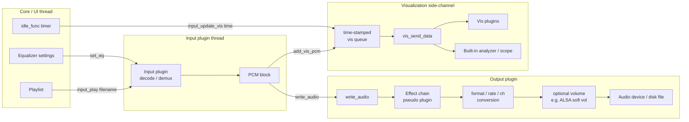
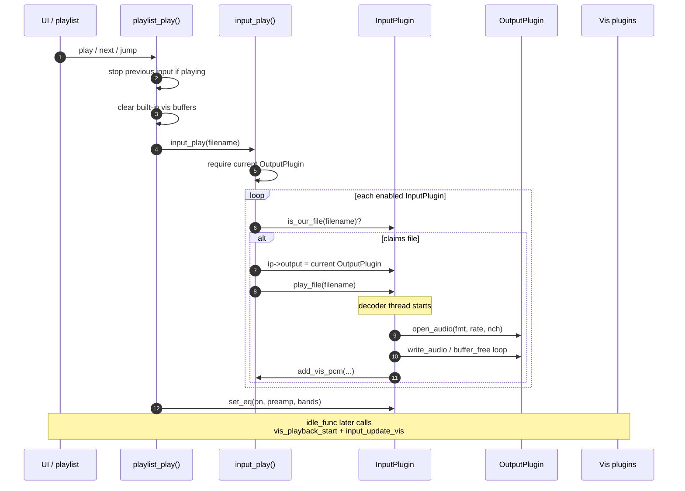
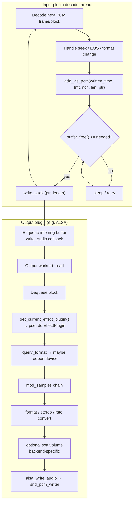
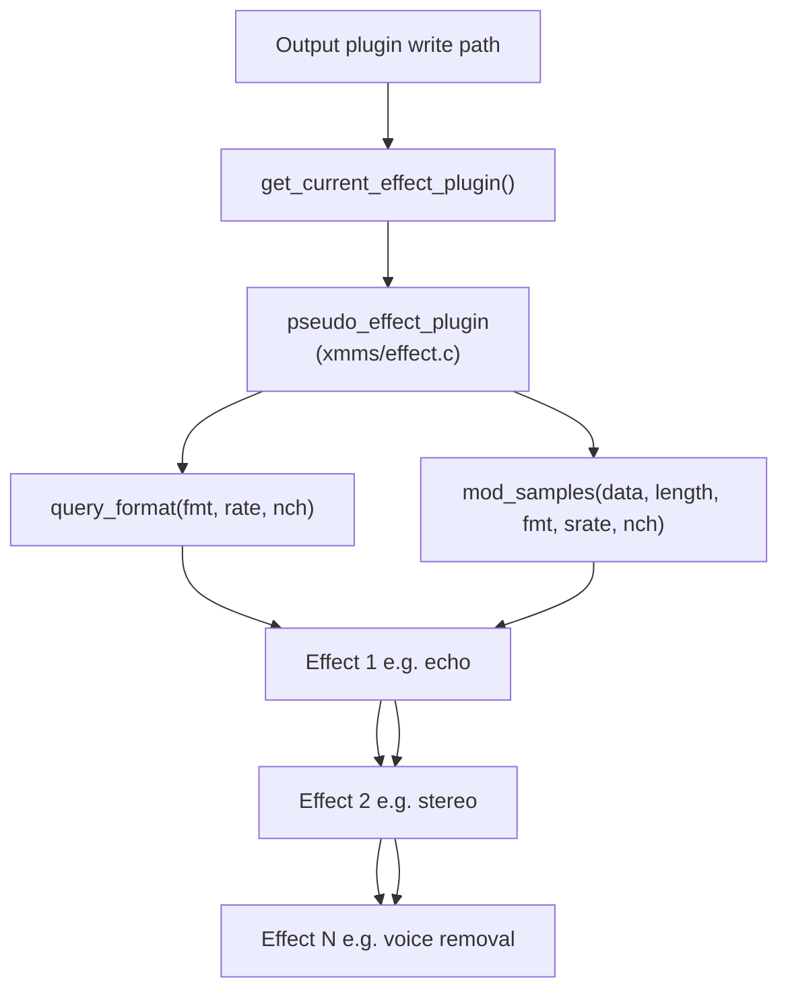
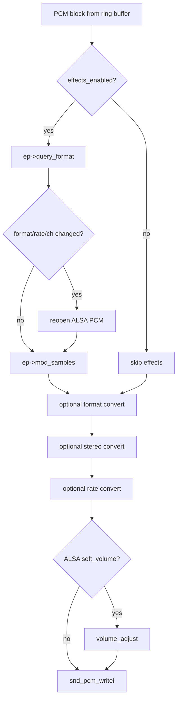
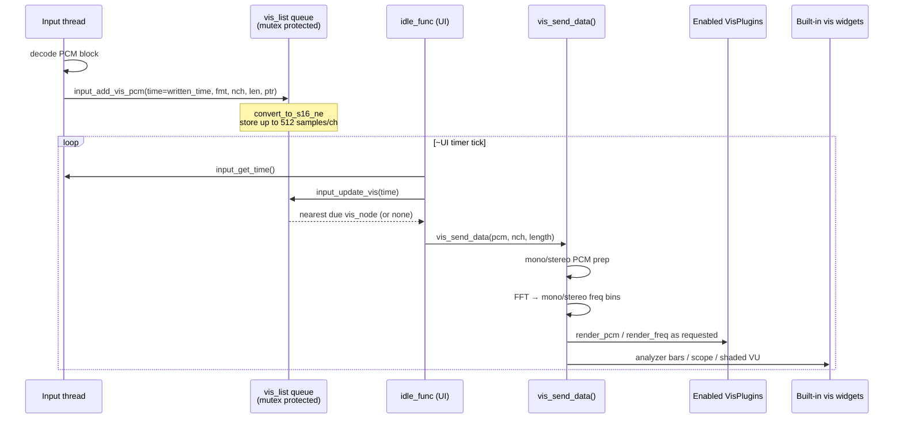
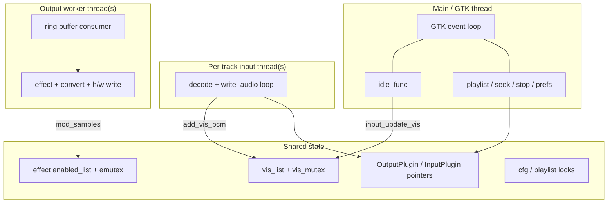
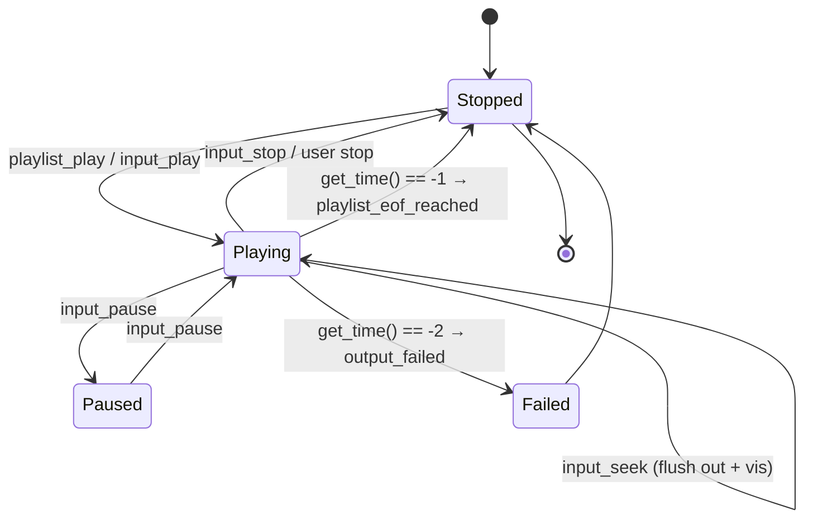
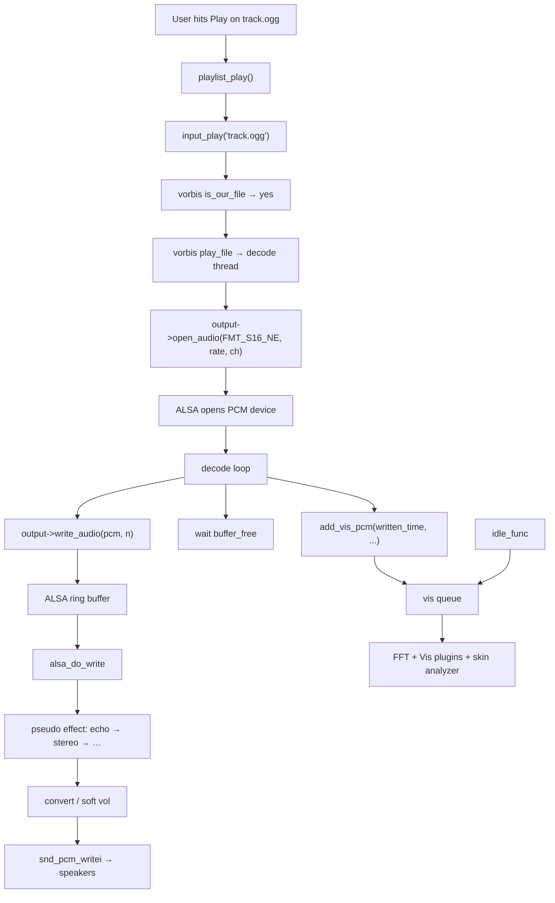

# Processing pipeline architecture

This document explains how audio moves through XMMS Classic: from a playlist
entry to PCM samples, through effects, out to the selected output backend,
and sideways into visualization.

Primary sources:

| Area | Files |
| --- | --- |
| Plugin vtables | [`xmms/plugin.h`](../../xmms/plugin.h) |
| Playback dispatch | [`xmms/playlist.c`](../../xmms/playlist.c), [`xmms/input.c`](../../xmms/input.c) |
| Effect chaining | [`xmms/effect.c`](../../xmms/effect.c) |
| Output / effects call site | e.g. [`Output/alsa/audio.c`](../../Output/alsa/audio.c) |
| Visualization | [`xmms/input.c`](../../xmms/input.c) (`input_add_vis_pcm`), [`xmms/visualization.c`](../../xmms/visualization.c) |
| UI timebase | [`xmms/main.c`](../../xmms/main.c) (`idle_func`) |

---

## 1. High-level pipeline

XMMS is not a single media graph library. It is a **pull/push hybrid** built
around five plugin kinds. Only three of those sit on the PCM path
(Input → Effect → Output). Visualization is a **side-channel** fed from the
decoder thread; General plugins sit outside the audio path entirely.



### Roles on the path

| Stage | Who owns it | Responsibility |
| --- | --- | --- |
| Source selection | Playlist / UI | Choose filename, start/stop/seek |
| Decode | **Input** plugin | Open file/stream, decode to interleaved PCM, drive playback loop |
| EQ (optional) | Input plugin `set_eq` | Applied inside the decoder when supported (e.g. mpg123) |
| Vis tap | Core (`input_add_vis_pcm`) | Normalize PCM to `gint16[2][512]`, queue by output timestamp |
| Buffering | **Output** plugin | Often a ring buffer + worker thread (e.g. ALSA/OSS; not every backend) |
| Effects | **Effect** plugins via pseudo-plugin | In-place `mod_samples`, optional format negotiation |
| Device write | **Output** plugin | Convert format/rate/channels, optional soft volume, write to h/w or file |
| Vis render | Core + **Vis** plugins | FFT / mono-stereo prep, `render_pcm` / `render_freq` |

---

## 2. Playback start sequence

Starting a track is a thin orchestration layer. The heavy work happens inside
the input plugin’s own thread after `play_file` returns (or is kicked off).



Key points from the code:

1. **`playlist_play()`** stops any current input, clears vis widgets, resolves
   the current playlist entry, then calls `input_play(filename)`.
2. **`input_play()`** walks the input list (skipping disabled plugins) and
   picks the first plugin whose `is_our_file()` returns true.
3. Before `play_file`, the core **injects** `ip->output =
   get_current_output_plugin()` so the decoder always talks to the selected
   output through the `OutputPlugin` vtable.
4. After play starts successfully, the playlist applies the **equalizer** via
   `input_set_eq` → optional `InputPlugin.set_eq`.
5. If no input plugin claims the file, XMMS still marks `playing = TRUE` so
   the idle loop will advance to the next playlist entry.

---

## 3. Steady-state PCM path (decode → device)

Once playing, the input plugin owns a decode loop. A representative path
(Vorbis / WAV / mpg123 / mikmod all follow the same pattern):



### Back-pressure contract

The input thread must not overrun the output buffer:

| Call | Meaning |
| --- | --- |
| `open_audio(fmt, rate, nch)` | Open/reconfigure device; output may downmix if h/w cannot match |
| `buffer_free()` | Bytes the input may still write |
| `write_audio(ptr, length)` | Push PCM into the output’s buffer |
| `written_time()` | Timestamp of data already handed to output (used for vis sync) |
| `output_time()` | Current audible position (used for UI time and seeking) |
| `flush(time)` | Drop buffered audio and reset internal clocks (seek) |
| `pause(paused)` | Pause/resume device |
| `close_audio()` | Tear down stream |

A common pattern is: **tap vis first** (using `written_time()`), then **spin
on `buffer_free()`**, then **`write_audio`**. That keeps the visualization
queue aligned with what the output has accepted, not with wall-clock decode
time.

---

## 4. Effect chain (the “pseudo” plugin)

Historically XMMS exposed a single effect plugin to output backends. Multiple
effects are supported by presenting a **pseudo EffectPlugin** that walks the
enabled list under a mutex.



`query_format` and `mod_samples` are **two separate passes** over the same
enabled-list order, not one combined walk.

### Contract

From [`xmms/plugin.h`](../../xmms/plugin.h) and [`xmms/effect.c`](../../xmms/effect.c):

- **`query_format`** — each enabled effect may rewrite the negotiated
  `AFormat`, sample rate, and channel count. The output plugin may reopen the
  device if the result differs from the current stream.
- **`mod_samples`** — transforms PCM in place (via `gpointer *data`) and
  returns the new length in bytes. Effects run in **enabled-list order**.
- **`effects_enabled()`** always returns true; the pseudo plugin is always the
  “current” effect. Individual effects are toggled via
  `enable_effect_plugin()`.
- Output plugins still call the old single-plugin API:

  ```c
  ep = get_current_effect_plugin();
  if (effects_enabled() && ep && ep->mod_samples)
      length = ep->mod_samples(&data, length, fmt, rate, nch);
  ```

### ALSA write path (concrete)

Simplified from `Output/alsa/audio.c` → `alsa_do_write()`:



Effects therefore run **inside the output plugin**, after the ring buffer and
before hardware conversion — not inside the input decoder. Software volume in
this diagram is ALSA-specific; other outputs may use hardware volume only or
no ring buffer at all.

---

## 5. Visualization side-channel

Visualization does **not** read from the output device. The input plugin
pushes a copy of each PCM block into a time-stamped queue; the UI idle loop
pops blocks whose timestamp is due.



### Data shapes

| Stage | Shape | Notes |
| --- | --- | --- |
| Input tap | raw `AFormat` buffer | Whatever the decoder produces |
| Queue node | `gint16 data[2][512]` | Native-endian signed 16-bit, ≤512 samples/ch |
| Vis PCM | `gint16[2][512]` | Mono duplicated or true stereo |
| Vis frequency | `gint16[2][256]` | From core FFT (`xmms/fft.c`) |
| Built-in analyzer | `gint8[75]` (or 19 bars / 2 VU) | Log-scaled bins for skin widgets |

`VisPlugin` declares how many channels it wants:

- `num_pcm_chs_wanted` → `render_pcm`
- `num_freq_chs_wanted` → `render_freq`

The core computes mono/stereo variants **lazily once per tick** and reuses
them across plugins.

Seeking (`input_seek`) **flushes** the vis queue so stale blocks do not flash
after a jump.

---

## 6. Equalizer placement

The graphic equalizer is **not** a generic Effect plugin. It is applied
through the input plugin interface:

```text
UI bands / preamp  →  input_set_eq()  →  InputPlugin.set_eq(on, preamp, bands)
```

Implications:

- Only inputs that implement `set_eq` actually filter audio (classically
  mpg123). Others may ignore it.
- EQ state is pushed when a track starts (`playlist_play`) and when the user
  moves sliders (`equalizerwin_eq_changed` → `input_set_eq`).
- Because EQ is decoder-side, it is **not** visible to the Effect chain and
  does not appear in the ALSA conversion path.


---

## 7. Threading model



| Thread | Typical work |
| --- | --- |
| GTK main | UI, preferences, playlist edits |
| Control-socket reader | Accept clients and queue remote commands |
| `idle_func` | Poll `input_get_time()`, advance playlist on EOF, drain vis queue, apply queued socket commands |
| Input plugin | Blocking decode, `buffer_free` wait, `write_audio` |
| Output plugin | Drain ring buffer, run effects, write to ALSA/OSS/… |

Cross-thread rules of thumb from the existing code:

- Vis queue access is guarded by `vis_mutex`.
- Effect enable list access is guarded by `emutex`.
- Playlist structure uses its own lock (`PL_LOCK` in playlist code).
- Plugins must not do heavy UI work from audio threads; configure/about run
  on the UI side.

---

## 8. Control & lifecycle around the pipeline



| User / system event | Pipeline reaction |
| --- | --- |
| Play | Resolve input, `open_audio`, start decode thread, `vis_playback_start` |
| Pause | `InputPlugin.pause` → usually `OutputPlugin.pause` |
| Seek | Free vis queue; input seeks; output `flush(time)` |
| Stop | `InputPlugin.stop` → `close_audio`; clear vis; `vis_playback_stop` |
| EOF (`get_time() == -1`) | Playlist advances (next / repeat / stop) |
| Output failure (`-2`) | Stop and show error dialog |
| Change output plugin | Next `open_audio` uses the new vtable (typically after stop) |
| Toggle effect | Append/remove from `enabled_list`; `init`/`cleanup` |

Volume is special-cased: if the **current input** implements
`get_volume`/`set_volume`, those win (e.g. some CD/audio paths); otherwise
volume goes to the **output** plugin.

---

## 9. End-to-end example: play an Ogg file via ALSA



Shipped plugins that participate in this story:

| Kind | Examples |
| --- | --- |
| Input | `mpg123`, `vorbis`, `wav`, `mikmod`, `cdaudio`, `tonegen` |
| Output | `alsa` (default on modern Linux), `OSS`, `esd`, `disk_writer`, `solaris`, `sun` |
| Effect | `echo_plugin`, `stereo_plugin`, `voice` |
| Visualization | `blur_scope`, `opengl_spectrum`, `sanalyzer` |

---

## 10. Design takeaways

1. **Inputs push; outputs buffer.** The decoder thread is the producer; the
   output plugin absorbs burstiness with a ring buffer and back-pressure via
   `buffer_free()`.
2. **Effects are output-side.** They see the same PCM the device is about to
   play, and may force a device reopen through `query_format`.
3. **Visualization is time-aligned, not device-tapped.** Using
   `written_time()` keeps scopes/analyzers roughly in sync with buffered
   audio rather than raw decode time.
4. **Vtables are C structs filled by `dlopen`.** The core never links
   directly against a codec or audio API; see
   [plugin-system.md](plugin-system.md).
5. **EQ is a special case** hanging off Input, not Effect — a historical
   WinAmp-era choice that still shapes where filtering can happen.
6. **General plugins** (remote control helpers, tray icons, etc.) attach via
   the control socket / UI and never see PCM.

---

## Related reading

- [UI interaction](ui-interaction.md) — how windows and controls reach this pipeline
- [Plugin system](plugin-system.md) — discovery, symbols, enable lists
- [Playlist and streaming](playlist-and-streaming.md) — metadata thread and HTTP inside inputs
- [External control](external-control.md) — clients that start playback remotely
- User-facing plugin overview in [docs/manual.md](../manual.md#36-plugins)
- Public vtable definitions in [`xmms/plugin.h`](../../xmms/plugin.h)
