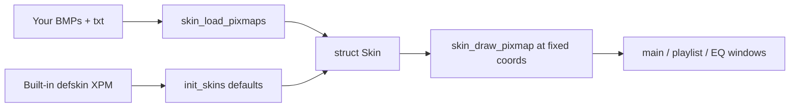

# Skin format requirements (WinAmp 2 / XMMS GTK4 Experimental)

This is the **hard requirements** reference for building skins that work in
XMMS GTK4 Experimental. It is written for:

- **Artists / designers** who want to draw a new skin  
- **Developers** who need to know how the loader and UI sample those bitmaps  

XMMS GTK4 Experimental implements the classic **WinAmp 2.x** skin layout. A skin that
works in WinAmp 2 classic mode is expected to work here, with the file set and
quirks documented below.

Primary implementation sources:

| Area | Files |
| --- | --- |
| Load / free / draw | [`xmms/skin.c`](../../xmms/skin.c), [`xmms/skin.h`](../../xmms/skin.h) |
| BMP decoder | [`xmms/bmp.c`](../../xmms/bmp.c) |
| Default embedded skin | [`xmms/defskin/`](../../xmms/defskin) (XPM fallbacks) |
| Main window sampling | [`xmms/main.c`](../../xmms/main.c) (`mainwin_create_widgets`) |
| Playlist / EQ sampling | [`xmms/playlistwin.c`](../../xmms/playlistwin.c), [`xmms/equalizer.c`](../../xmms/equalizer.c) |
| User install paths | [manual §2.3](../manual.md#23-skin-installation) |

---

## 1. What a skin is

A skin is a **directory or archive of bitmap sprites + optional text configs**.
It does **not** contain layout XML or free-form CSS. Window sizes, button
positions, and which rectangle of which BMP is used for “Play pressed” are
**fixed in the XMMS binary**. You only replace the pixels (and optional
colors/masks).



**Missing files are allowed.** Any BMP that is absent or fails to load keeps
the **default skin** artwork for that slot. Incomplete skins still run; they
just look mixed.

---

## 2. Packaging and installation (artists)

### 2.1 Acceptable packages

| Form | Notes |
| --- | --- |
| **Directory** of files | Loaded as-is |
| **`.wsz` / `.zip`** | Extracted with `unzip` (override via `UNZIPCMD`) |
| **`.tar` / `.tar.gz` / `.tgz` / `.bz2`** | Extracted with `tar` / `bzip2` (`TARCMD` override) |

Archives are unpacked to a temp dir with **`unzip -j`** (junk paths) or tar
into that dir, then scanned **recursively** for the expected filenames
(`find_file_recursively`). Nested folders are OK; **duplicate basenames** are
resolved by the first match found.

### 2.2 Where to put skins

| Location | Role |
| --- | --- |
| `~/.xmms/Skins/` | User skins (created on first run) |
| `$prefix/share/xmms/Skins` | System skins |
| `SKINSDIR` | Extra colon-separated search paths |

In the player: **Alt+S** skin browser, or Options → Skin Browser. Current skin
path is saved in `~/.xmms/config`. **F5** reloads the current skin.

### 2.3 File naming (hard requirement)

Filenames are matched **case-insensitively** on typical Linux filesystems only
if your FS is case-insensitive; on ext4 they are **case-sensitive** as stored.
WinAmp convention is **lowercase**:

```text
main.bmp
cbuttons.bmp
titlebar.bmp
shufrep.bmp
text.bmp
volume.bmp
balance.bmp          # optional; falls back to volume.bmp
monoster.bmp         # note spelling: monoster, not monostereo
playpaus.bmp
nums_ex.bmp          # preferred numbers strip
numbers.bmp          # fallback if nums_ex missing
posbar.bmp
pledit.bmp
eqmain.bmp
eq_ex.bmp
pledit.txt           # optional colors
region.txt           # optional window shape masks
viscolor.txt         # optional analyzer colors
```

No other extensions are loaded for artwork (only BMP via `read_bmp`).  
Do **not** rely on PNG/JPEG/GIF.

### 2.4 Image format (hard requirement)

| Property | Requirement |
| --- | --- |
| Container | Windows **BMP** |
| Decoder | [`bmp.c`](../../xmms/bmp.c) — classic WinAmp-era BMPs |
| Color | Practical skins use **8-bit paletted** or 24-bit RGB BMP |
| RLE | BI_RLE4 / BI_RLE8 supported by decoder; uncompressed is safest |
| Alpha | **No alpha channel.** Transparency for *windows* uses `region.txt` masks, not per-pixel alpha in BMPs |

Export from GIMP/Photoshop as **Windows BMP**, 8-bit or 24-bit, avoid exotic
headers. If a BMP fails to load, that layer silently falls back to default.

---

## 3. Canvas sizes (hard layout)

Windows are fixed; doublesize scales **2×** in the player (you still author at
1× coordinates).

| Window | Normal | Windowshade | Doublesize normal |
| --- | --- | --- | --- |
| Main player | **275×116** | **275×14** | 550×232 |
| Equalizer | **275×116** | **275×14** | 550×232 |
| Playlist | **≥275×116**, width steps of **25 px** from 275 | shaded height 14 | scaled similarly |

`main.bmp` should be **at least 275×116**. Larger images are clipped to the
default pixmap size when blitting; smaller images only cover part of the
window (rest may show garbage/default).

---

## 4. Required and optional assets

### 4.1 Bitmap inventory

| File | Used for | Typical minimum size* | Optional? |
| --- | --- | --- | --- |
| `main.bmp` | Main window background | 275×116 | Falls back to default |
| `cbuttons.bmp` | Transport buttons | ~136×36 | default |
| `titlebar.bmp` | Titlebar, shade bar, menurow, shade seek | wide strip (see §5) | default |
| `shufrep.bmp` | Shuffle/repeat/EQ/PL toggles | ~92×85 | default |
| `text.bmp` | Bitmap font (5×6 cells) | **≥152×6** (else default colors) | default |
| `volume.bmp` | Volume slider track + knob frames | tall strip (see §5) | default |
| `balance.bmp` | Balance slider | same idea as volume | **yes** → uses `volume.bmp` |
| `monoster.bmp` | Mono/stereo indicators | ~58×24 | default |
| `playpaus.bmp` | Play/pause/stop status glyphs | ~39×9 | default |
| `nums_ex.bmp` | Time digits 0–9 + `−` | **≥108×13** ideal | preferred |
| `numbers.bmp` | Digits without dash | ≥99×13 | if no `nums_ex` |
| `posbar.bmp` | Seek bar + knob | ≥307×10 | default |
| `pledit.bmp` | Playlist chrome (tileable) | WinAmp pledit layout | default |
| `eqmain.bmp` | EQ full + shade pieces | 275×… tall | default |
| `eq_ex.bmp` | EQ windowshade extras | 275×… | default |
| `pledit.txt` | Playlist text colors | — | yes |
| `region.txt` | Shaped window masks | — | yes (rectangular default) |
| `viscolor.txt` | Built-in vis palette | 24 RGB lines | yes |

\*“Typical” sizes match WinAmp 2 base skin / XMMS defskin usage. The loader
does not reject wrong sizes; wrong sizes cause **clipped or empty controls**.

### 4.2 Load order quirks (developers & advanced artists)

From `skin_load_pixmaps()`:

1. Prefer **`nums_ex.bmp`**. If missing, load **`numbers.bmp`** and
   **synthesize** a dash glyph by copying digit art (`skin_numbers_generate_dash`).
2. If **`balance.bmp`** missing → reuse **`volume.bmp`**.
3. If **`text.bmp`** is smaller than 152×6, title **gradient colors** are taken
   from the **default** text pixmap, not yours.
4. Each successful BMP’s usable size is
   `min(file_size, default_slot_size)` — oversized skins are clipped to the
   built-in template dimensions.

---

## 5. Sprite maps (what to draw where)

Coordinates below are **source rectangles inside the BMP** (left, top) and
**destination on the 275×116 main window** where relevant. They come from
`mainwin_create_widgets` and related draw code.

### 5.1 `main.bmp` — base art

Paint the full player face **275×116** as users see it with no buttons pressed:
title area, visualization hole, panel, empty button wells, etc. Interactive
controls are **overdrawn** from other BMPs; matching the wells to those sprites
avoids seams.

Rough main-window regions (destination):

| Region | Approx. dest (x,y,w,h) |
| --- | --- |
| Title bar | 0,0 → 275×14 |
| Clutterbar / menurow | 10,22 8×43 |
| Time digits | 36–99, 26  (9×13 cells) |
| Song title text | 112,27 153×… |
| Vis | 24,43 76×16-ish |
| Volume | 107,57 68×13 |
| Balance | 177,57 38×13 |
| Seek | 16,72 248×10 |
| Transport | 16,88 … |
| Shuffle/repeat | 164,89 / 210,89 |
| EQ / PL toggles | 219,58 / 242,58 |

### 5.2 `cbuttons.bmp` — transport

| Control | Dest on main | Size | Source normal | Source pressed |
| --- | --- | --- | --- | --- |
| Previous | 16,88 | 23×18 | 0,0 | 0,18 |
| Play | 39,88 | 23×18 | 23,0 | 23,18 |
| Pause | 62,88 | 23×18 | 46,0 | 46,18 |
| Stop | 85,88 | 23×18 | 69,0 | 69,18 |
| Next | 108,88 | 22×18 | 92,0 | 92,18 |
| Eject | 136,89 | 22×16 | 114,0 | 114,16 |

Provide at least **two rows** (released / pressed).

### 5.3 `titlebar.bmp` — window chrome + shade

Used for menu/minimize/shade/close (9×9 hits), windowshade transport hits,
shade-mode seek knob, and the vertical **menurow** (Options/AOT/…):

| Control | Dest | Size | Notes |
| --- | --- | --- | --- |
| Menu | 6,3 | 9×9 | src 0,0 / 0,9 |
| Minimize | 244,3 | 9×9 | 9,0 / 9,9 |
| Shade | 254,3 | 9×9 | src y 18 or 27 when shaded |
| Close | 264,3 | 9×9 | 18,0 / 18,9 |
| Menurow | 10,22 | 8×43 | sources around x=304 in titlebar strip |
| Shade seek | 226,4 | 17×7 | shade mode |

Also supplies **windowshade** title backgrounds (draw paths use several
horizontal slices). Follow a known-good WinAmp titlebar template when unsure.

### 5.4 `shufrep.bmp` — toggles

| Control | Dest | Size | States |
| --- | --- | --- | --- |
| Shuffle | 164,89 | 46×15 | 4 states (off/on × up/down) from src x=28 |
| Repeat | 210,89 | 28×15 | 4 states from src x=0 |
| EQ win | 219,58 | 23×12 | 4 states y≈61/73 |
| PL win | 242,58 | 23×12 | 4 states |

### 5.5 `text.bmp` — bitmap font

| Cell | Size |
| --- | --- |
| Glyph | **5×6** pixels |
| Minimum useful sheet | **152×6** (and often a second row for symbols) |

Mapping (from `textbox.c`):

- `A–Z` → x = `5 * (c - 'A')`, y = 0  
- `0–9` → digit row  
- Many punctuation glyphs at fixed x on y=6 ( `: ( ) - ' ! _ + \ / [ ] ^ & % . = $ #` …)  
- Some extended characters on further rows  

Title scroll, bitrate, and frequency strings all sample this font unless the
user enables an X11 font for the main title.

### 5.6 `nums_ex.bmp` / `numbers.bmp` — big clock

| Digit | Size | Layout |
| --- | --- | --- |
| Each numeral | **9×13** | Placed at x = `n * 9` for `0–9` |
| Minus / blank | x ≈ 90+ | `nums_ex` includes dash; plain `numbers` gets a generated dash |

Destinations on main: roughly x=36,48,60,78,90 at y=26.

### 5.7 `volume.bmp` / `balance.bmp`

Horizontal sliders with **animated track frames** and a **knob**:

| Slider | Dest | Track w×h | Knob | Frame table |
| --- | --- | --- | --- | --- |
| Volume | 107,57 | 68×13 | 14×11 | frames along y (offset 422 in create_hslider) |
| Balance | 177,57 | 38×13 | 14×11 | same sprite conventions; balance may share volume.bmp |

Author volume/balance as a **vertical stack of track frames** plus knob glyphs
in the classic WinAmp positions (copy geometry from Base-2.x skin).

### 5.8 `posbar.bmp` — seek

| Piece | Role |
| --- | --- |
| Background bar | 248×10 dest at 16,72 |
| Knob | 29×10 sources around x=248–278 |

### 5.9 `playpaus.bmp` — status

Small glyphs (~9×9) composited at dest **24,28** (play/pause/stop lamp).

### 5.10 `monoster.bmp`

**56×12** dest at **212,41**. Sheet holds mono/stereo on/off tiles
(~27×12 and 29×12 halves).

### 5.11 `pledit.bmp` + `pledit.txt`

Playlist window **chrome** (corners, tiles, buttons). The list **text colors**
come from `pledit.txt`:

```ini
[text]
normal=#00FF00
current=#FFFFFF
normalbg=#000000
selectedbg=#0000C0
```

| Key | Meaning |
| --- | --- |
| `normal` | Ordinary entry text |
| `current` | Playing entry |
| `normalbg` | List background |
| `selectedbg` | Selection background |

Colors: `#RRGGBB` (leading `#` optional). Incomplete hex is parsed
WinAmp-compatibly (see `load_skin_color`).

Playlist minimum size **275×116**; width grows in **25 px** tile steps.

### 5.12 `eqmain.bmp` / `eq_ex.bmp`

| Asset | Role |
| --- | --- |
| `eqmain.bmp` | Full EQ 275×116 face, on/off/presets, sliders, shade strips (y≈134/149) |
| `eq_ex.bmp` | Extra shade-mode title graphics |

Sliders (preamp + 10 bands) sample vertical strips inside `eqmain` via
`eq_slider` widgets—use a WinAmp EQ template for knob/slot alignment.

### 5.13 Windowshade mode

When shaded, height is **14 px**. Art comes mainly from **titlebar** (main) and
**eq_ex / eqmain** slices (EQ). Transport hit targets move to the shade bar
(small invisible/`sbutton` regions). Always test **shade** and **doublesize**.

---

## 6. Optional config files

### 6.1 `viscolor.txt`

Up to **24 lines**, each `R,G,B` (0–255) for the built-in analyzer/scope
palette. Missing file → built-in default table in `skin.c`.

### 6.2 `region.txt` — shaped windows

Defines **1-bit masks** as polygons (WinAmp `region.txt`):

| Section | Window | Base size |
| --- | --- | --- |
| `[Normal]` | Main normal | 275×116 |
| `[WindowShade]` | Main shade | 275×14 |
| `[Equalizer]` | EQ normal | 275×116 |
| `[EqualizerWS]` | EQ shade | 275×14 |

Each section needs:

```ini
[Normal]
NumPoints=4,4
PointList=0,0,274,0,274,115,0,115,0,0,50,50,100,50,100,100,50,100
```

- `NumPoints` — comma-separated vertex counts per polygon  
- `PointList` — flat `x,y` list for all polygons in order  
- Doublesize masks multiply coordinates by 2 automatically  

If omitted or invalid → **full rectangle** mask (normal rectangular window).

Playlist window builds its mask separately (not these four sections alone);
focus region.txt on **main + EQ** first.

---

## 7. Artist checklist (minimum viable skin)

1. Start from a known WinAmp 2 **base skin** or XMMS default geometry.  
2. Paint at **1×** (275-wide main/EQ).  
3. Export every layer as **Windows BMP**, lowercase names above.  
4. Include at least: `main`, `cbuttons`, `titlebar`, `text`, `nums_ex`,
   `volume`, `posbar`, `shufrep`, `pledit`, `eqmain`.  
5. Add `pledit.txt` colors that contrast with your list background.  
6. Optional polish: `balance`, `viscolor.txt`, `region.txt`, `eq_ex`,
   `playpaus`, `monoster`.  
7. Zip as **`.wsz`** (or folder under `~/.xmms/Skins/`).  
8. Test in XMMS: normal, **windowshade**, **doublesize**, playlist resize,
   EQ on/off, all transport buttons, volume/seek.  
9. Press **F5** after overwriting files to reload.

### Common failure modes

| Symptom | Likely cause |
| --- | --- |
| Default buttons on custom main | Wrong BMP name/size or failed BMP decode |
| Garbled title text | `text.bmp` too small or wrong 5×6 grid |
| No `-` in time | Use `nums_ex.bmp` or accept generated dash from `numbers.bmp` |
| Balance looks like volume | Only `volume.bmp` provided (expected fallback) |
| Square window, no shape | Missing/invalid `region.txt` |
| Black playlist text | `pledit.txt` missing or low contrast |
| Archive does nothing | No `unzip` in `PATH`; install unzip or use a folder skin |

---

## 8. Developer notes

### 8.1 Runtime model

```text
init_skins()
  → allocate Skin, load defskin XPM into def_pixmap slots
  → create_skin_window()

load_skin(path|NULL)
  → free previous non-default pixmaps
  → maybe skin_decompress_skin (zip/tar)
  → skin_load_pixmaps
  → setup_skin_masks
  → redraw main / playlist / EQ
```

Drawing always goes through **`skin_draw_pixmap(SkinIndex, sx, sy, dx, dy, w, h)`**,
which prefers `pixmap` and falls back to `def_pixmap`.

### 8.2 Hit testing is not in the skin

Widget positions live in C (`create_pbutton`, `create_hslider`, …). Skins
**cannot** move the Play button. Changing layout requires code changes, not
skin format extensions.

### 8.3 Doublesize

UI allocates 2× backing pixmaps and scales coordinates. Masks from
`region.txt` are generated twice (1× and 2×). Authors still deliver 1× BMPs.

### 8.4 Compatibility priority

Comments in `load_skin_color` explicitly maximize **WinAmp compatibility**
(including odd short hex colors). When extending the loader, prefer not
breaking classic `.wsz` sets.

### 8.5 Security / robustness (maintainers)

Archive extract uses `system()` with shell-escaped paths. Treat skin packs as
untrusted input; failed loads must not crash (current code generally falls
back). Temp dirs under `$TMPDIR/xmmsskin.*` are deleted after load.

---

## 9. Quick reference — files XMMS reads

```text
main.bmp cbuttons.bmp titlebar.bmp shufrep.bmp text.bmp
volume.bmp balance.bmp monoster.bmp playpaus.bmp
nums_ex.bmp numbers.bmp posbar.bmp
pledit.bmp eqmain.bmp eq_ex.bmp
pledit.txt region.txt viscolor.txt
```

Anything else in the pack is ignored by the core (may still be used by
third-party tools).

---

## Related reading

- [UI interaction](ui-interaction.md) — how skinned widgets sit on GTK windows  
- [User manual — Skin installation](../manual.md#23-skin-installation)  
- Built-in fallback art: [`xmms/defskin/`](../../xmms/defskin)  
