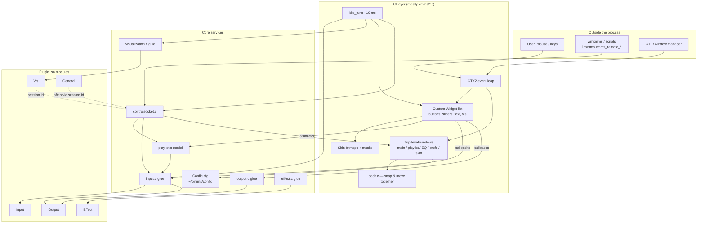
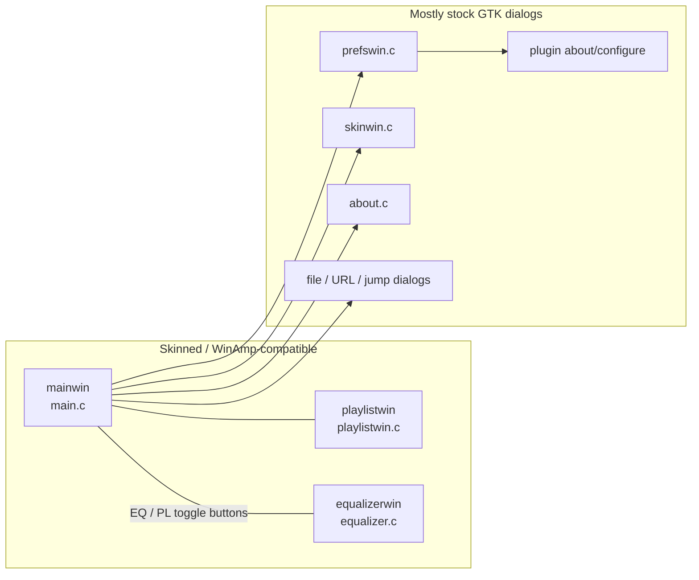
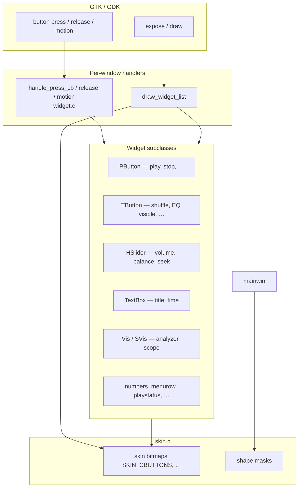
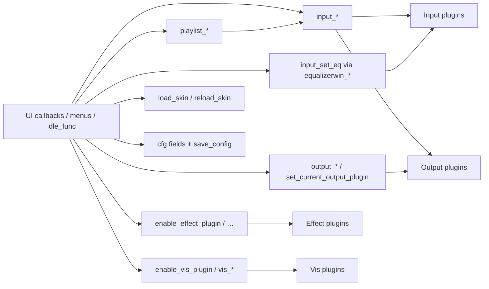
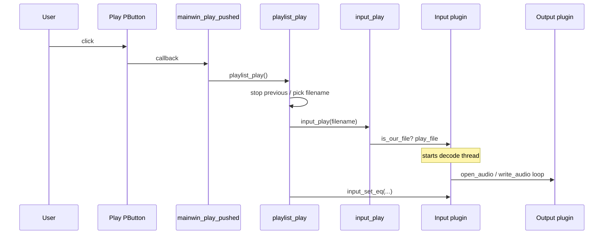
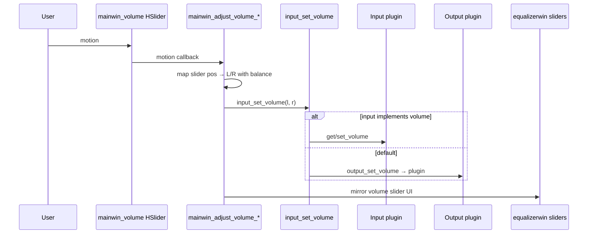
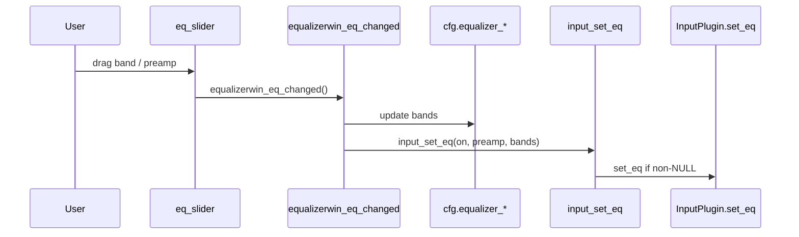
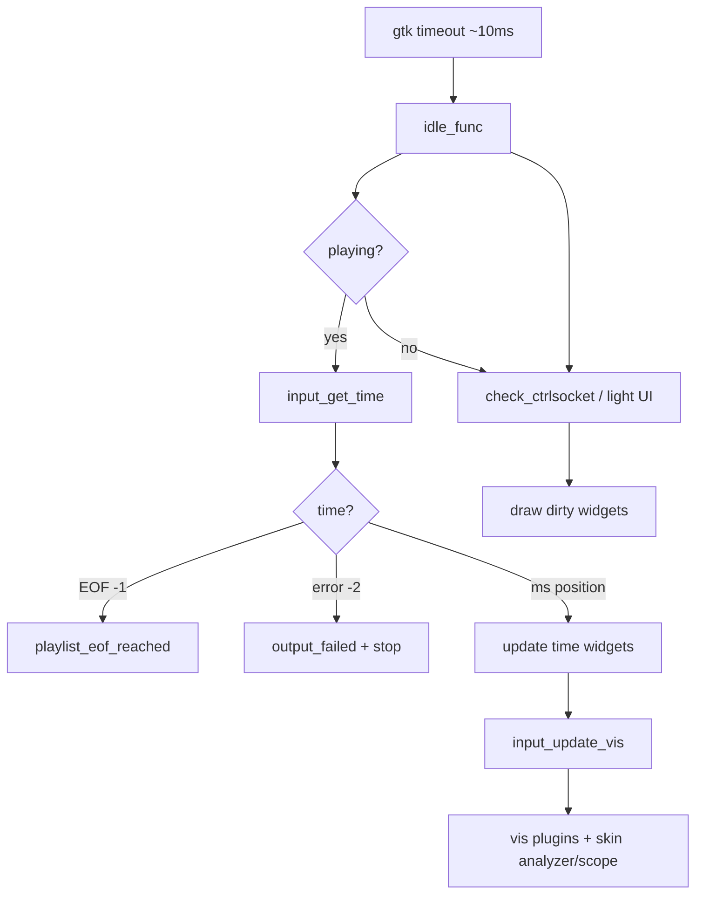
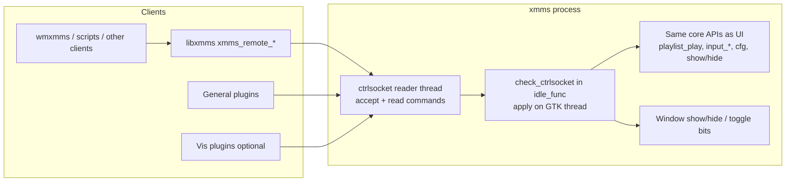
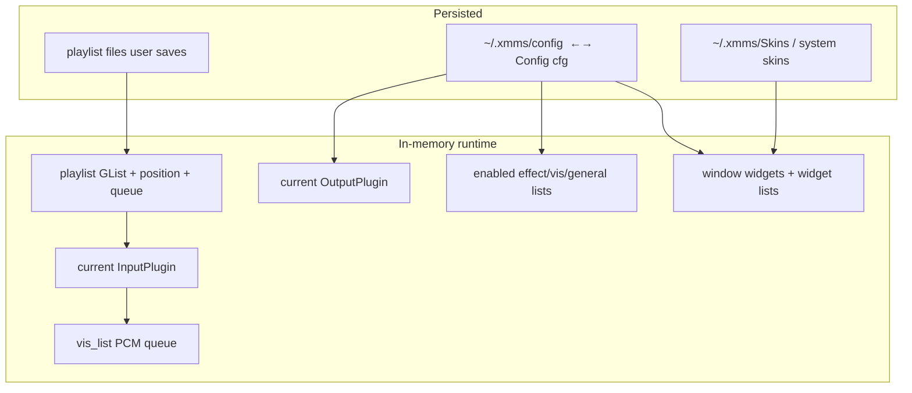

# UI interaction architecture

This document is a **medium-to-high-level map** of how the XMMS Classic user
interface talks to the rest of the program. It is aimed at someone opening the
tree for the first time and wanting to know:

- which windows exist and what code owns them
- how a button click becomes playback
- what sits *between* the UI and the audio plugins
- how remote tools and plugins reach the same controls the mouse does

For the PCM path itself, see [processing-pipeline.md](processing-pipeline.md).
For plugin loading, see [plugin-system.md](plugin-system.md).

Primary sources:

| Area | Files |
| --- | --- |
| Main window & global config | [`xmms/main.c`](../../xmms/main.c), [`xmms/main.h`](../../xmms/main.h) |
| Custom skinned widgets | [`xmms/widget.h`](../../xmms/widget.h), `pbutton.c`, `hslider.c`, … |
| Playlist window | [`xmms/playlistwin.c`](../../xmms/playlistwin.c) |
| Playlist model | [`xmms/playlist.c`](../../xmms/playlist.c) |
| Equalizer window | [`xmms/equalizer.c`](../../xmms/equalizer.c) |
| Preferences | [`xmms/prefswin.c`](../../xmms/prefswin.c) |
| Skins | [`xmms/skin.c`](../../xmms/skin.c) |
| Window docking | [`xmms/dock.c`](../../xmms/dock.c) |
| Remote control | [`xmms/controlsocket.c`](../../xmms/controlsocket.c), [`libxmms/xmmsctrl.h`](../../libxmms/xmmsctrl.h) |
| Idle / refresh loop | `idle_func()` in [`xmms/main.c`](../../xmms/main.c) |

---

## 1. Big picture: UI is a client of the core

XMMS does **not** put decode/output logic inside GTK callbacks. The UI is a
skinned front-end that:

1. reads/writes a global **`Config cfg`** and a few window widgets
2. calls into a small set of **core APIs** (playlist, input, output, effect,
   visualization, skin, equalizer helpers)
3. is itself driven on a timer by **`idle_func`**, which polls playback state
   and refreshes displays

Plugins never draw the main WinAmp-like chrome. They may open their own GTK
dialogs (`about` / `configure`) and, for Vis/General plugins, attach via the
control socket session id.

**Reading tip:** when you see a UI file call `playlist_play()` or
`input_set_volume()`, you are crossing from “looks” into “behavior.” When you
see `idle_func` call `input_get_time()` or `input_update_vis()`, the core is
pushing state *back* into the UI.

---

## 2. The windows you actually see

XMMS is a multi-window player. Three skinned windows form the classic face;
several plain GTK dialogs handle configuration.

| Window | Global widget | Main responsibilities |
| --- | --- | --- |
| **Main player** | `mainwin` | Transport, volume/balance, seek, title, bitrate, built-in vis, menus |
| **Playlist editor** | `playlistwin` | List view, add/remove/sort, queue, its own mini transport |
| **Equalizer** | `equalizerwin` | On/off, preamp, 10 bands, presets; volume/balance mirrors |
| **Preferences** | (prefswin) | Plugin lists, output selection, title format, misc options |
| **Skin browser** | (skinwin) | Pick `.wsz` / skin directories |

Window positions, visibility, shade mode, and doublesize live in **`Config
cfg`** ([`main.h`](../../xmms/main.h)) and are saved on exit.

The three skinned windows are registered with **`dock.c`** so they can snap
together and move as a group — that is UI chrome only; it does not affect
audio.

---

## 3. Skinned UI stack (how a click is handled)

The main/playlist/EQ windows are **not** built from rows of `GtkButton`s.
Each is a `GtkWindow` whose content is a **GdkPixmap** painted from skin
bitmaps. Interactive regions are entries in a **`GList` of custom `Widget`s**.

### Mental model

| Layer | What it is | Where to look |
| --- | --- | --- |
| GTK shell | `GtkWindow`, events, menus (`GtkItemFactory`) | `main.c`, `playlistwin.c`, `equalizer.c` |
| Widget list | Hit-testing + draw callbacks | `widget.c` / `widget.h` |
| Controls | Buttons, sliders, text, built-in vis | `pbutton.c`, `hslider.c`, `textbox.c`, `vis.c`, … |
| Skin | Bitmaps, colors, window shapes | `skin.c`, `bmp.c`, `defskin/` |
| Callbacks | `void (*)(void)` or small helpers | end of each control’s create site in `main.c` |

Example (conceptual): the Play button is created roughly as “a `PButton` on
`mainwin_wlist` at skin coords …, callback `mainwin_play_pushed`.” The skin
supplies the up/down glyphs; the callback supplies the behavior.

**Doublesize / windowshade** change coordinates and which controls are
visible, but they still go through the same widget lists and callbacks.

---

## 4. Core APIs the UI actually calls

Think of these modules as the **façade** between chrome and plugins:

| UI wants to… | Typical call | Lands in |
| --- | --- | --- |
| Start current track | `playlist_play()` | playlist → `input_play` → Input plugin |
| Stop | `mainwin_stop_pushed()` → `input_stop()` | Input plugin `stop` + output close |
| Pause | `input_pause()` | Input → often Output `pause` |
| Next / previous | `playlist_next()` / `prev()` | playlist position + play |
| Seek | slider → `input_seek(ms)` | Input `seek` + output `flush` |
| Volume / balance | `input_set_volume(l, r)` | Input override **or** Output volume |
| Toggle EQ band | `equalizerwin_eq_changed()` → `input_set_eq` | Input `set_eq` if implemented |
| Change output plugin | prefs → `set_current_output_plugin` | next `open_audio` uses new vtable |
| Enable effect/vis | prefs checkboxes | `enable_*_plugin` |
| Show song title | `mainwin_set_info_text` / playlist info | filled by Input via `set_info` |

The UI almost never calls `OutputPlugin` or `InputPlugin` function pointers
directly; it goes through the glue files. That keeps window code free of
`dlopen` details.

---

## 5. Example flows (start here when tracing code)

### 5.1 User presses Play

Same entry points are used by:

- playlist window transport buttons
- double-click in the playlist list
- control socket `CMD_PLAY`
- some General plugins via `xmms_remote_play()`

### 5.2 User drags the volume slider

Balance works the same way: UI math in `main.c`, device control via
`input_set_volume`.

### 5.3 User moves an EQ slider

Important for newcomers: **EQ is not an Effect plugin.** It is a main-window
feature that asks the *current input* to filter, if it can. See
[processing-pipeline.md §6](processing-pipeline.md#6-equalizer-placement).

### 5.4 Preferences: select output / toggle plugins

The preferences window is the main **plugin management UI**:

- lists come from `get_input_list()`, `get_output_list()`, etc.
- enabling effects/vis/general calls `enable_*_plugin`
- choosing output calls `set_current_output_plugin` and updates
  `cfg.outputplugin`
- About/Configure buttons call `*_about` / `*_configure`, which invoke the
  plugin’s own GTK dialogs

No audio flows through prefswin; it only mutates selection state and `cfg`.

---

## 6. The idle loop: UI as a live dashboard

Playback does not “push” GTK redraws from the decoder thread for most chrome.
Instead, **`gtk_timeout_add(10, idle_func, NULL)`** runs about every 10 ms on
the main thread and:

1. If playing → `vis_playback_start()`, read `input_get_time()`
2. On EOF (`time == -1`) → `playlist_eof_reached()` (next/repeat/stop)
3. On output failure (`time == -2`) → error UI + stop
4. Otherwise update time displays, seekbar, playlist time
5. **`input_update_vis(time)`** → drain vis queue → built-in + Vis plugins
6. **`check_ctrlsocket()`** → apply remote commands queued by the control-socket reader thread
7. Trigger skinned redraws as needed

This is why UI code must be careful with locks: `idle_func` is the heartbeat
that couples **playlist advancement**, **visualization**, and **IPC** to the
GTK thread.

---

## 7. Remote control and “headless” UI actions

External programs do not scrape the GTK widgets. They speak a small binary
protocol to a **Unix domain control socket** (not D-Bus).

| Mechanism | Role |
| --- | --- |
| `setup_ctrlsocket` | Opens the Unix socket and starts the reader thread |
| Reader thread (`ctrlsocket_func`) | Accepts clients and queues parsed commands |
| `check_ctrlsocket` (from `idle_func`) | Applies queued commands on the GTK/main thread |
| `libxmms/xmmsctrl.c` | Client API used by tools and plugins |
| `CMD_*` enum in `controlsocket.h` | Play, playlist edit, volume, EQ, window toggles, quit, … |

Design consequence: **anything a remote command can do, the UI can do through
the same core functions** (and vice versa for most transport ops). When
adding a feature, prefer a core API + thin UI and socket call sites over
duplicating logic in the window code.

General and Vis plugins receive `xmms_session` at load time so they can call
back into this socket without linking the whole player.

---

## 8. Where state lives

| State | Owner | UI interaction |
| --- | --- | --- |
| `Config cfg` | `main.c` load/save | Almost every toggle writes a field |
| Playlist entries | `playlist.c` (locked) | Playlist window + main transport |
| Current plugins | `*_data` structs in glue files | Prefs + play-time selection |
| Skin | `skin.c` global | Skin browser / reload; all draws read it |
| Vis queue | `input.c` | Written by input thread; read by `idle_func` |

---

## 9. Suggested reading order for newcomers

### Boot sequence (where `main()` wires things)

A simplified startup order when reading `main.c`:

1. Read **`~/.xmms/config`** into `Config cfg`
2. **`setup_ctrlsocket()`** — Unix socket + reader thread
3. **`init_plugins()`** — `dlopen` inputs/outputs/effects/vis/general
4. Create skinned windows (main / playlist / equalizer) and prefs/skin dialogs
5. **`gtk_timeout_add(10, idle_func, …)`** — UI heartbeat
6. **`gtk_main()`** — event loop

### Reading order from the UI outward

1. **`xmms/main.h`** — `Config` and the main window API surface  
2. **`mainwin_play_pushed` / `idle_func` in `main.c`** — transport + heartbeat  
3. **`playlist_play` in `playlist.c`** — how UI play becomes a filename  
4. **`input_play` in `input.c`** — bridge into plugins  
5. **`widget.h` + one control (`pbutton.c`)** — how skinned hit-testing works  
6. **`prefswin.c` (plugin tabs only)** — how users enable pipeline pieces  
7. **`controlsocket.c` command switch** — parallel non-GUI entry points  
8. Then [processing-pipeline.md](processing-pipeline.md) for PCM detail  

### File ↔ concern cheat sheet

| Want to change… | Start in |
| --- | --- |
| Play/pause/stop buttons | `main.c` callbacks → `playlist.c` / `input.c` |
| Title scroll / time display | `main.c` + `textbox.c` + `idle_func` |
| Playlist look & selection | `playlistwin.c`, `playlist_list.c` |
| Playlist data structure | `playlist.c` |
| EQ sliders | `equalizer.c`, `eq_slider.c` |
| Skin loading | `skin.c`, `skinwin.c` |
| Preferences / plugin enable | `prefswin.c` |
| Built-in analyzer/scope | `vis.c`, `svis.c`, `visualization.c` |
| Window snapping | `dock.c` |
| Remote control socket API | `controlsocket.c`, `libxmms/xmmsctrl.c` |
| Actual audio decode/output | `Input/*`, `Output/*` (not UI files) |

---

## 10. Design takeaways

1. **UI is skinned chrome + callbacks**, not the media engine.  
2. **Playlist + input glue** are the real “controller”; windows are views.  
3. **`idle_func` is mandatory reading** — it ties time, EOF, vis, and IPC to GTK.  
4. **Remote control reuses core APIs**, so behavior stays consistent without a
   second implementation.  
5. **Plugins extend behavior and dialogs**, but the classic three windows stay
   in the core binary.  
6. **Config is a big global struct** — simple, historical, and referenced from
   almost every UI module; expect `cfg.` reads in draw and click paths.

---

## Related reading

- [Processing pipeline](processing-pipeline.md) — what happens after Play  
- [Plugin system](plugin-system.md) — how prefs-enabled modules get loaded  
- [External control](external-control.md) — libxmms, wmxmms, General plugins  
- [Playlist and streaming](playlist-and-streaming.md) — get-info thread and HTTP inputs  
- [Skins](skins.md) — BMP/layout requirements for skinned chrome  
- [User manual](../manual.md) — end-user description of the same windows  
